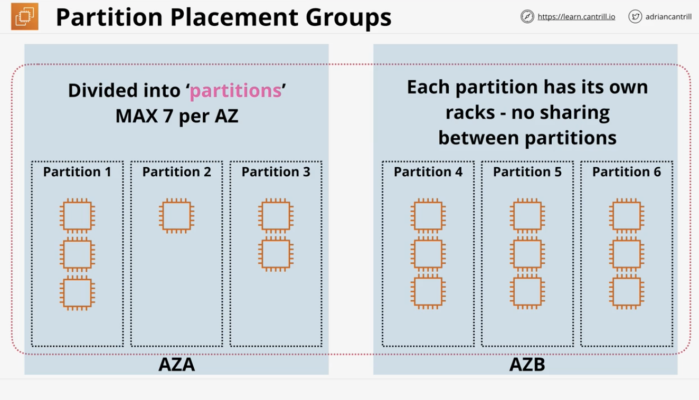

# Advanced EC2

### Bootstrapping EC2 using User Data
- Bootstrapping allows EC2 Build Automation 
- User Data - Access via the meta-data IP
  - http://169.254.169.254/latest/user-data
- Anything in User Data is executed by the instance OS
- ONLY on launch 
- EC2 doesn't interpret, the OS needs to understand the User Data
- User Data Key Points:
  - It's opaque to EC2- it's just a block of data 
  - It's NOT secure - don't use it for passwords or long term credentials (ideally) 
  - User data is limited to 16KB in size 
  - Can be modified when instance stopped 
  - But only executed once at launch 
- Boot-time-to-service-time 

### EC2 Instance Roles
- Credentials are inside meta-data
- iam/security-credentials/role-name
- automatically rotated - always valid 
- should always use roles rather than adding access keys into instance 
- CLI tools will use ROLE credentials automatically 

### SSM Parameter Store 
- Overview: 
  - Storage for configuration and secrets 
  - Types of Parameters: String, StringList, SecureStrings
  - Types of things to store: License codes, Database String, Full Configs & Passwords
  - Stores parameters using hierarchies & versioning
  - Can also store plaintext and ciphertext -> incorporates within KMS 
  - Parameters also knows public parameters - latest AMIs per region 
- Architecture:
  - Public service 
  - Tightly integrated into IAM 
  - If parameters are encrypted, then KMS also involved. Need to set appropriate permissions to the CMK inside KMS 
  - Can create simple or complex system of passwords 
  - Examples:
    - myDBpassword
    - /wordpress/
      - DBUser (/wordpress/DBUser)
      - DBPassword (/wordpress/DBPassword)
    - /my-cat-app/
    - /dev-team-passwords/ 
  - Changes to passwords can create/initiative events that occur in other AWS products

### System and Application Logging on EC2
- Overview:
  - CloudWatch is for metrics 
  - CloudWatch Logs is for logging 
  - Neither natively capture data inside an Instance 
  - CloudWatch agent is required, plus the configuration and permissions
- Architecture:
  - Wordpress can't inject logs into cloudwatch without the agent. 
    - So, configure the agent so that it knows what to do 
  - The agent needs permissions to interact with AWS. 
    - So, create an IAM role with access to CloudWatch logs. 
    - Attach this role to the EC2 instance
  - Can store the agent configuration as a parameter store 

### EC2 Placement Groups 
- Overview:
  - Allow us to influence the placements of the instances in the AWS host ecosystem 
- Types of Placement Groups:
  - Cluster: pack instances close together. Performance
  - Spread: keep instances separated. Resilience
  - Partition: groups of instances spread apart. Topology Awareness
- Cluster Placement Groups:
  - Want to achieve the highest level of performance/throughput in EC2
  - Use same type of instance and launch them all at the same time
  - Must be in the same AZ 
  - Usually same rack, and sometimes same host 
  - All members have direct connections to each other 
    - High single stream of data 10Gps (compared to 5Gps normally)
  - Lowest latency and max PPS (packets per second) and possible in AWS 
  - Tradeoff:
    - If the hardware fails, then the system will likely fail because offers little resilience
  - Key details:
    - Can't span AZs- ONE AZ ONLY
    - Can span VPC peers, but impacts performance
    - Requires a supported instance type 
    - Use the same type of instance (best practice, but not mandatory)
    - Launch all instances at the same time (best practice, but not mandatory) 
    - 10Gbps `single` stream performance on EC2 
    - Use cases: performance, fast speeds, low latency 
- Spread Placement Groups:
  - Spans multiple AZs, and likely spans multiple racks 
    - Each has their own networking card, and other hardware 
  - 7 instances per AZ - isolated infrastructure limit 
  - Key points:
    - Provides infrastructure isolation - each instance runs from a different rack
    - 7 instances per AZ (HARD LIMIT)
    - Not supported for Dedicated instances or hosts
    - Use cases: small number of critical instances that need to be kept separated from each other 
    - Separation is handled by default by AWS 
- Partition Placement Groups:
  - Designed for more than 7 instances per AZ 
  - Divided into 'partitions' - MAX 7 per AZ 
  - Each partition has its own racks - no sharing between partitions 
  - Can launch as many instances as you want into each partition 
  - 
  - Designed for huge scale systems 
  - Key points:
    - 7 partitions per AZ 
    - Instances can be placed into a specific partitions or let it be autoplaced by AWS 
    - Partition placement groups are not supported for Dedicated Hosts
    - Create for HDFS, HBase, and Cassandra

### Dedicated Hosts 
- Overview:
  - EC2 Host dedicated to you 
  - Pay for the host for a specific family (e.g. a1, c5, m5)
  - No instance charges because you're paying for the host itself 
  - Can pay via: on-demand & reserved (1-3 years; full, partial, none upfront payment) options available 
  - Host hardware has physical sockets and cores 
- Limitations & Features:
  - AMI Limits - No RHEL, SUSE Linux, and windows AMIs
  - Amazon RDS instances not supported
  - Placement groups are not supported for dedicated hosts 
  - Hosts can be shared with other AWS accounts in your organization via AWS RAM

### Enhanced Networking & EBS Optimized
- Enhanced Networking Overview:
  - Required for cluster placement groups
  - No charge - available on most EC2 types 
  - Uses `SR-IOV` - NIC is virtualization aware
    - Presents multiple logical cards per physical card
    - Each instance is assigned to a logical card to pass data (which is the same as if it were a logical card)
    - The physical network interface card handles this process end-to-end, which consumes a lot less of the host CPU
    - Thus:
      - Higher I/O & lower host CPU usage 
      - More bandwidth 
      - Higher packets per second (PPS)
      - Consistent lower latency 
- EBS Optimized Instances:
  - EBS = block storage over the network 
  - Historically network was shared for data and EBS storing 
  - EBS Optimized = means dedicated capacity for EBS' usage 
    - and data performance isn't impacted
  - Most instances support this and have this enabled by default 
  - Some older instances support this, but enabled costs extra
