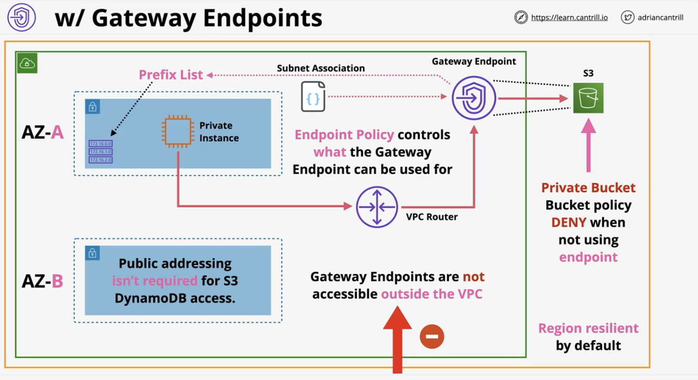

# Advanced VPC Networking

### VPC Flow Logs
- Overview:
  - VPC not real time
  - Only capture packet metadata, and not packet contents
    - if want content, then need a packet sniffer 
  - Can be applied to:
    - A VPC - all interfaces in that VPC 
    - Subnet - interfaces in that subnet 
    - Network interface directly, so only monitor traffic in one interface
  - Destination can be S3 or CloudWatch logs 
    - Mainly preference on which to use 
- Architecture 
  - Flow log inheritance:
    - VPC -> Subnet -> Interface 
    - If applied to VPC, then subnet and interface inherit the flow log
    - If applied to Subnet, then interface inherits
    - If applied to interface, then only that interface has the flow log
  - Logs destination can to S3 or CloudWatch logs
  - If want to capture flow logs from DB and web interface in AZ-B,
    - Option 1: Apply to subnet in AZ-B
    - Option 2: Apply to either DB or Web interface in AZ-B
    - 
- VPC Flow Logs Content:
  - Key fields:
    - SRC addr
    - DST addr
    - SRC port
    - DST port
    - Protocol 
      - ICMP = 1
      - TCP = 6
      - UDP = 17
    - Action 
      - ACCEPT 
        - If only one line with an accept, then likely a security group (which allows request & response)
      - REJECT
        - If have ACCEPT then REJECT, then might mean ACL with accepting requests, but deny response because of security groups
        - (security groups are stateful)

### Egress-Only internet gateway 
- Overview:
  - NAT allows private IPv4 IPs to access public networks
    - without allowing external initiated connections (IN) into the private IP
  - Internet gateway (IPv6) allows all IPs IN and OUT
    - NAT not compatible with IPv6
    - IPv6 all IPs are public in AWS 
  - Egress-Only is for `outbound-only for IPv6`
- Architecture:
  - Same as other internet gateways
    - highly available by default across all AZs in the region
    - Scales as required 
  - Default IPv6 route ::/0 added to route table with eigw-id (Egress-only internet GW) as target
    - Data going out through the gateway to a specific target 
    - That specific target can also send data back because the gateway is `stateful`
    - TL;DR: Two-way traffic is granted to any specific target the subnet initiates connections with
  - Any other inbound data is denied 
  - 

### VPC Endpoints (Gateway)
- Overview:
  - Provide private access to S3 and DynamoDB (two services that are public services)
  - Prefix list added to route table in a subnet, which then points to the gateway endpoint
    - Prefix list is an object (logical entity) that represents S3 of DynamoDB
      - It's like a list of IP addresses that those services use (and the list is maintained by AWS)
  - Highly available across all AZs in a region by default 
  - Endpoint policy 
    - allows admin to control what things can be connected to by that gateway endpoint 
    - only allows gateway endpoint to connect to a particular subset of S3 buckets
  - Can only access services in the same region
    - Can't access cross-region services 
    - e.g. can't access S3 bucket in a different region from a gateway endpoint in another region 
  - Main use cases:
    - Private VPC and want to allow that private VPC to connect to public resources (S3 or DynamoDB)
    - Private only S3 bucket (configure bucket policy to only accept operations coming from specific gateway endpoint)
      - S3 is private by default, so implicit deny for anything else 
  - Limitations:
    - Gateway endpoints only accessible from inside that specific VPC 
- Architecture:
  - 
  
### VPC Endpoints (Interface)
- Overview:
  - Provide private access to AWS public services
    - Historically used to provide access to ALL services EXCEPT S3 and DynamoDB
    - But now supports S3 🎉
    - DyanmoDB is only through gateway endpoints 
  - Interface endpoints are `not` highly available by default
    - They are interfaces inside a specific subnet inside a VPC (and a subnet is only in 1 AZ)
    - Compared to gateway endpoints, which are highly available 
    - To make it highly available, 
      - need to add 1 interface endpoint in one subnet in each AZ inside a VPC 
      - TL;DR: # of AZ == # of interface endpoints 
  - Network access controlled via Security Groups 
    - Can use security groups to control access to that interface endpoint 
    - This is because the endpoint is inside a VPC 
    - Can't do this with gateway endpoints 
  - Endpoint policies: 
    - Restrict what can be done with the end point 
    - Same as gateway endpoints 
  - `Only supports TCP and IPv4` 
  - Uses PrivateLink
    - Product that allows external services to be injected into your VPC, either from AWS or 3rd parties 
    - Given network interfaces inside your VPC subnet 
  - Endpoint provides a NEW service endpoint DNS 
  - Endpoint Regional DNS 
  - Endpoint Zonal DNS 
  - Applications can optionally these, or 
    - PrivateDNS overrides the default DNS for services (enabled by default)
- Architecture:
  - `Without` interface endpoints and `without` PrivateDNS:
    - 
    - Private instance can't access the SNS service in the public internet 
  - `With` interface endpoints and `without` PrivateDNS:
    - 
    - Use Endpoint DNS
    - Interface endpoint directly connects to SNS, as if the SNS is injected directly into the public subnet of the VPC 
  - `With` interface endpoints and `with` PrivateDNS:
    - Use endpoint-specific DNS
    - 
- Key points:
  - Gateway endpoints: work using prefix list and route tables, so never require changes to the applications
    - Creates a blackbox to the application by rerouting the traffic directly to the services
  - Interface endpoints uses DNS and private IP address for endpoint
    - Can use endpoint-specific DNS names, or enable PrivateDNS (which overrides default) 
    - Don't use routing, use DNS 
  - High Availability:
    - Gateway endpoints are HA
    - Interface endpoints are `NOT` HA
      - Use normal VPC interfaces (single AZ)
  - 

### VPC Peering
- Overview:
  - Direct encrypted network link between two VPCs (only TWO)
  - Works same/cross-region and same/cross-account
  - (optional) Public hostnames resolve to private IPs
  - Same region security groups can reference peer security groups 
  - Routing configuration is needed between both VPCs (via logical gateway object)
    - Security groups and NACL can filter 
- Key facts:
  - VPC peering connects two VPCs (and only two VPCs)
  - Connection is not transitive 
    - VPC A -> VPC B // VPC B -> VPC C
    - VPC A does not mean there's a connection to VPC C 
- Architecture:
  - 
