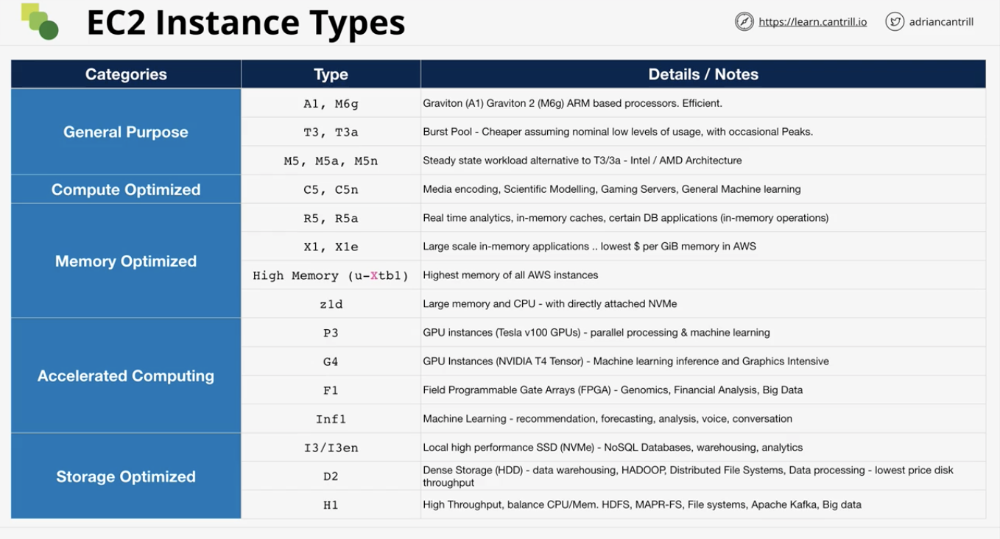

# Elastic Compute Cloud (EC2) Basics

### Virtualization 101
- Virtualization: Running more than 1 OS on a single set of physical hardware 
- SR-IOV is a specification that allows a PCIe device to appear to be multiple separate physical PCIe devices

### EC2 Architecture and Resilience
- EC3 instances are virtual machines (OS + Resources)
- EC2 Instances run on EC2 hosts (physical hardware)
  - Hosts are shared or dedicated 
  - Shared hosts are isolated from each other and are the default 
  - Dedicated - dedicated to their account 
- AZ resilient service; hosts = 1 AZ. Thus, if the AZ fails, then the host fails, then instance fails 
- Instances stay on a host unless:
  - Host fails or is taken down for maintenance 
  - Instance is stopped and then started (different from restarting)
  - But in both cases, the instance will stay in the same AZ 
- Instances of same type, size and generations will be clustered together in the same host 
- What's EC2 good for?
  - Traditional OS + application compute 
  - Long-running compute needs 
  - Server style applications 
    - or servers that have either burst or steady-state load 
  - Monolithic application stack 
    - database, middleware, other run-time components 
  - Migrating application workloads or Disaster Recovery 
  - Default compute service within AWS 

### EC2 Instance Types 
- When choosing an instance type, you're choosing:
  - Raw CPU, memory, local storage capacity, and type
  - Resource ratio (e.g. more cpu and less memory, etc.) 
  - Storage and Data network bandwidth 
  - System architecture / vendor 
  - Additional features and capabilities 
- EC2 Categories:
  - General purpose (default): Diverse workloads, equal resource ratio 
  - Compute Optimized: Media process, high performance computing (HPC), scientific modeling, gaming, machina learning
    - More CPU than memory; 
  - Memory Optimized: processing large in-memory datasets, some database workloads
  - Accelerated Computing: hardware GPU, field programmable gate arrays (FPGAs)
  - Storage optimized: sequential and random IO, scale-out transactional datbases, data warehousing, elastic search, 
    analytic workloads
    
- Decoding EC2 Types:
  - Example: R5dn.8xlarge (instance type)
    - R - Instance family 
    - 5 - Instance generation number 
    - dn - additional capabilities 
    - 8xlarge - instance size

### Storage Refresher
- Key terms:
  - Direct (local) attached storage - storage on the EC2 Host (called Instance Store)
  - Network attached storage - Volumes delivered over the network (Elastic Block Store)
  - Ephemeral storage - Temporary storage 
    - Example: Physical storage attached to an EC2 host
  - Persistent storage - permanent storage - lives on past the lifetime of the instance 
    - Example: EBS 
  - Block Storage: Volume presented to the OS as a collection of blocks- no structure provided. Mountable and bootable.
    - Ex: inside EBS 
  - File storage: presented as a file share, has structure. Mountable, but not Bootable.
  - Object storage: collection of objects, flat (no structure). Not mountable and not bootable. Super scalable
    - Example: S3
- Storage performance: 
  - IO (block) size
    - e.g. size of the wheels of a car
  - IOPS (Input-output operations per second) 
    - e.g. speed of an engine of a racecar runs at (revs per second)
  - Throughput (amount of data transferred in a given second)
    - e.g. The end speed of the race car 
  - IO (block) size * IOPS = Throughput 

### Elastic Block Store (EBS) Service Architecture
- Block storage - raw disk allocations (volume) - can be encrypted using KSM 
  - instances see block device and create file system on this device (ext3/4, xfs)
  - Storage is provisions in ```ONE AZ``` (resilient in that AZ)
    - For extra resilience, can copy the EBS volume so that the data is accessible throughout the region 
  - Attached to one (can have more, but added overhead) EC2 instance (or other service) over a storage network 
    - detached and reattached, not lifecycle linked to one instance- persistent 
  - Snapshot (backup) into S3. Create volume from snapshot (migrate between AZs)
  - Different physical storage types, different sizes of volumes, and difference performance profiles 
  - Billed based on GB-month (and in some cases, performance) 

### EBA Volume Types - General Purpose
- GP2:
  - Volumes can be as small as 1 GB or as large as 16 TB 
  - an IO Credit is 16KB, IOPS assume 16KB. 1 IOPS is 1 IO in 1 second
  - IO 'credit' bucket = capacity of 5.4million IO credits. Fills at rate of baseline performance 
  - Bucket fills with min 100 IO credits per second, regardless of volume size 
  - Beyond the 100 minimum, the bucket **fills/replenishes** with 3 IO credits per second, per GB of volume size (Baseline performance) 
  - Key thing to remember is that the IO rate the bucket is consuming should be less than the IO rate at which the bucket refills
  - For volumes larger than 1,000 GB, baseline is above the burst. Credit system isn't used and you always achieve baselin 
  - GP2 is good for:
    - `Boot volumes, low-latency interactive apps, dev, and test` 
- GP3:
  - SSD environment
  - Removes bucket credit architecture from GP2
  - Each bucket starts at 3,000 IOPS & 125 MiB/s - standard (regardless of volume size)
  - Bucket sizes range from 1GB to 16TB
  - Pricing:
    - GP3 is 205 cheaper than GP2
    - For extra cost, can go up to 16,000 IOPS or 1,000 MiB/s
  - 4x faster max throughput vs GP2:
    - GP3: 1,000 MiB/s
    - GP2: 250 MiB/s
  - Use for:
    - Virtual desktops, medium sizes single instance DBs (MSSQl and Oracle DB), low-latency interactive apps, 
      dev & test, boot volumes 

### EBS Volume Types - Provisioned IOPS
- io1/io2
- Consistent low latency & jitter
- With io1/2/block express, IOPS can be adjusted independently of volume size
- Use for:
  - High perforamnce, latency, sensitive workloads, I/O intensive NoSQL, and relational databases

### EBS Volume Types - HDD-Based
- ST1 - throughput optimized 
  - designed for data taht needs to be written or read in a sequential way
  - IO on HDD-based volumes measure at 1MB blocks. So 500 IOPS = 500MB/second
  - Use for:
    - When cost is a concern, but need frequent access storage for throughput intensive sequential workloads
    - e.g. big data, data warehouses, and log processing 
- SC1 - Cold HDD
  - Designed for infrequent workloads. Geared towards storing lots of data and don't care about performance
  - Maximum 250 MB/s (and 250 IOPS)
  - Lowest cost EBS storage available 
  - Use for:
    - Colder data requiring fewer scans per day 
    - e.g. archives 
- Use SC1 if possible. If can't accommodate the use cases (e.g. infrequent workloads), then use ST1
- If need more IOPS, then use SSD based storage 

### Instance Store Volumes - Architecture
- Block storage devices 
- similar to EBS, except local instead of over the network 
- Attach to instant (provided by OS) and used as the basis for a file system, then used by applications
- Physically connected to one EC2 host
- Instances on that host can access them 
- Highest storage performance in AWS
- Included in instance price 
- `Must attach at launch time `
- Temporary storage because it's host specific, and instances can move hosts 
- Physical hardware failures would also cause the data to be lost 
- Some instance types don't support instance store volumes 
- Types:
  - D3 - 4.6 GB/s throughput 
  - I3 = 16 GB/s of sequential throughput 
  - More IOPS and throughput vs EBS 

> - Exam Powerup:
>  - Local on EC2 
>  - Add at launch only 
>  - Lost on instance move, resize, or hardware failure 
>  - High performance 
>  - You pay for it anyway - included in instance price 
>  - `TEMPORARY` 

### Choosing between the EC2 Instance Store and EBS 
- Persistence: EBS (avoid instance store) 
- Resilience: EBS (avoid instance store) 
- Storage isolated from instance lifecycle: EBS
- Resilience a/ app in-built replication: it depends 
- High performance needs: it depends 
- Super high performance needs: Instance store
- Cost: Instance store (it's often included) 
- Cheap/Coast: ST1 or SC1 
- Throughput/streaming: ST1
- Boot: NOT ST1 or SC1
- IOPS: 
  - GP2/3 gets up to 16,000 IOPS 
  - IO1/2 gets up to 64,000 IOPS (*256,000 for block express)
  - RAID0 + EBS up to 26,000 IOPS (io1/2-BE/GP2/3)
  - Instance store for more than 260,000 IOPS (keep in mind non-persistent storage)

### Snapshots, Restore & Fast Snapshot Restore (FSR)
- Snapshot overview:
  - Snapshots are incemental volume copies to S3 
  - Data becomes region resilient (because they're in S3)
  - The first snapshot is a full copy of 'data' (only data used) on the volume 
    - e.g. if  only 10gb is used of 40gb, then only the 10gb will be used 
  - Future snaps are incremental - difference between this snapshot and previous snapshot
    - If a previous snapshot is accidentally deleted, then the new snapshot will make up for the deleted snapshot 
  - Volumes can be created/restored from snapshots 
  - Snapshots can be copied to another region 
- Volume Performance:
  - New EBS Volume = full performance immediately 
  - Snaps restore lazily (aka data is fetched gradually)
  - Requested blocks are fetched immediately 
  - Options:
    - Force a read of all data immediately from snapshots into the volume
  - Fast Snapshot Restore (FSR) - immediate restore 
    - up to 50 snaps per region. Set on the Snap and AZ 
    - Costs extra to do this 
    - Can achieve the same results via force a read of every block mentioned above
- Billing:
  - GB-month 
  - Used data, **NOT** allocated data

### EBS Encryption 
- Without encryption, the data is stored as plaintext at rest 
- To encrypt: 
  - Keys used:
    - EBS default (aws/ebs), or
    - customer managed CMK and KMS 
  - Encrypted key is stored with the volume. The decrypted key is only ever stored on the EC2 host's memory 
    - Because of this, EC2 can encrypt/decrypt data as it goes to/from the volume 
- If the EC2 instance ever moves hosts, then the decrypted key in memory is deleted. But the encrypted key is still in the volume
- Key inheritance:
  - Any snapshots created from a volume also is encrypted. Can be decrypted with same key from volume
  - Any volumes created from the encrypted snapshot is also encrypted. Can also be decrypted with same key 
  - If make a new volume from scratch, then there's a new encryption key to be made 
> - Exam powerup: 
>  - Accounts can be set to encrypt EBS volumes by default - Default CMK
>    - Otherwise, choose a CMK to use
>  - CMK isn't used directly to encrypt volumes. Each volume uses 1 unique Data Encryption Key (DEK)
>    - Snapshots and future volumes use the same DEK 
>  - Can't change a volume to be NOT encrypted 
>  - OS isn't aware of the encryption, thus no performance loss
>  - Encryption is via AES 256 

### Network Interfaces, Instance IPs and DNS
- Primary ENI & Secondary ENI get:
  - Mac address
  - Primary IPv4 private IP
    - does not change 
    - Has a DNS name that's only used within the VPC 
  - 0 or more secondary IPs
  - 0 or 1 public IPv4 address
    - once the instance is stopped, this IP address will change when started up again
    - also has a DNS name 
  - 0 or 1 elastic IP per private IPv4 address 
    - Allocated to each AWS account 
    - If apply an elastic IP address with primary interface, then the normal & non-elastic IPv4 address that the
      the instance had is removed. Then the elastic IP becomes the instance's new public IPv4 address. 
    - If apply elastic IP to instance, then remove it, then a new public IPv4 address will replace it.
  - 0 or more IPv6 addresses
  - Security Groups
  - Source/Destination check 
  - Secondary does all the above, except secondary can be detached and moved to other EC2 instances

> - Exam power-up:
>  - Secondary ENI + MAC = Licensing 
>  - Multi-homed (subnets) Management & Data 
>  - Different Security Groups - multiple interfaces 
>  - OS - DOESN'T see public IPV4 address 
>  - IPv4 Public IPs are dynamic. Any stop and start = the IP address is changed
>  - Public DNS = private IP in VPC. Public IP everywhere else

### Amazon Machine Images (AMI)
- Images of EC2: blueprint to make EC2 instances 
  - can be used to launch EC2 instances 
- AWS or community provided
- MArketplace (can include commercial software) 
- Regional- each has their own unique ID
  - AMI can only be used in the region that they're in
- Permissions (public, your account, specific accounts)
- Can create an AMI from an existing EC2 instance you want to template 
- Life cycle:
  - Launch
    - Use an AMI to launch an instance
  - Configure
  - Create Image
    - Create AMI from the configurations from the above step 
    - Container with associate information 
    - EBS snapshots are mapped within the AMI image (take the snapshot ID)
  - Launch
    - Use the AMI to deploy the instance once again 

- Exam Powerups:
  - AMI = one region, only works in that region (can use it to deploy instances in other regions)
  - AMI baking: creating an AMI from configured instance + application 
  - An AMI cannot be edited; take AMI to launch instance, then update config, then make a new AMI 
  - Can be copied between regions (including its snapshots)
  - Remember permissions. Default = your account
  - Billed for capacity of the EBS snapshots 

### Instance Billing Models
- Types of models:
  - On-demand instances
    - Instances have an hourly rate (based on instance types)
    - Billed in seconds (60s minimum) or hourly 
    - Default pricing model 
    - No long-term commitments or upfront payments 
    - New or uncertain application requirements 
    - Short-term, spiky, or unpredictable workloads which **can't tolerate any disruption**
  - Spot instances
    - Offers up to 90% off the on-demand pricing
    - A spot price is set by EC2 - based on spare capacity 
    - Can specify the maximum price you'll pay 
    - If the spot price goes above your maximum, then the instance terminates 
    - Applications that have flexible start/end times 
    - Apps which only make sense at low cost 
    - Apps which can tolerate failure and continue later
  - Reserved Instances
    - Up to 75% off the on-demand price- for a commitment
    - 1 or 3 years
      - all upfront & no hourly rate
      - partial upfront & reduced hourly rate
      - no upfront & reduced hourly rate
    - Reserved in region, or AZ with capacity reservation 
      - AZ priority: reserved, on-demand, spot
    - Scheduled reservations 
    - Known steady state usage 
    - Lowest cost for apps which can't handle disruption 
    - Need reserved capacity on EC2 hosts
  - Dedicated Hosts 

### Instance Status Checks & Auto Recovery
- System status checks:
  - loss of system power
  - loss of network connectivity 
  - host software/hardware issues
- Instance status checks:
  - corrupted file system 
  - incorrect instance networking
  - OS kernel issues 

### Horizontal & Vertical Scaling
- Vertical scaling: upgrading the EC2 instance to a larger size/capacity 
  - Each size requires a reboot - disruption 
  - Larger instances often carry a $ premium
  - There is an upper cap on performance - instance size 
  - No application modification required 
  - Works for all applications - even monoliths 
- Horizontal scaling: increase the number of instances
  - Need a form of a load balancer 
  - Sessions, sessions, sessions = need to maintain the unique information or progress of the customer 
  - Requires application support OR off-hosts sessions to maintain a stateless application 
    - e.g. host data in a separate system 
  - No disruption when scaling 
  - No real limits to scaling 
  - Often less expensive - no large instance premium 
  - More granular 

### Instance Metadata
- EC2 service provides data to instances 
- Accessible inside ALL instances 
- `http://169.254.169.255/latest/meta-data/`
  - Remember this URL for the exam 
  - IP address to access the instance metadata 
- Environment 
- Networking
- Authentication 
- `Metadata service - no authentication or encyrpted`
  - Anyone who can connect to the instance and connect to the CLI, then they can access the metadata IP address
  - 
