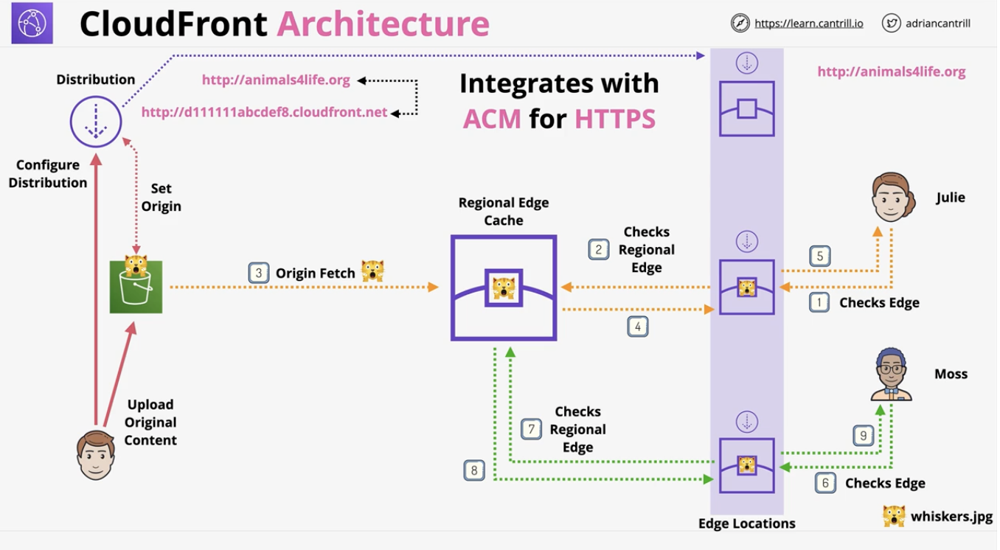
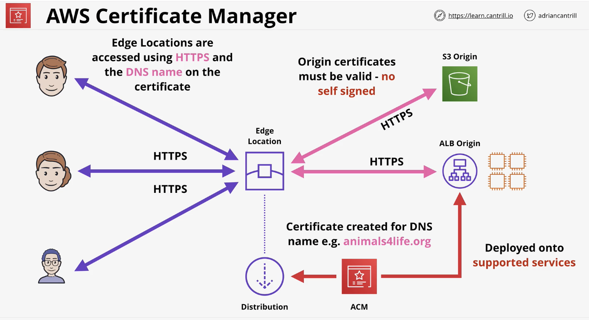
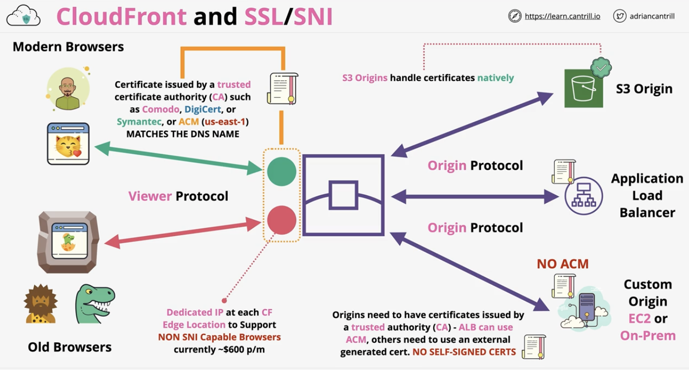
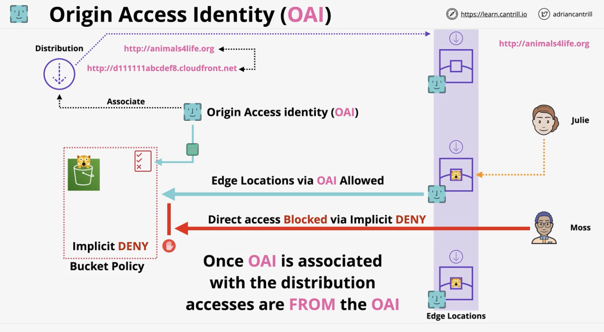
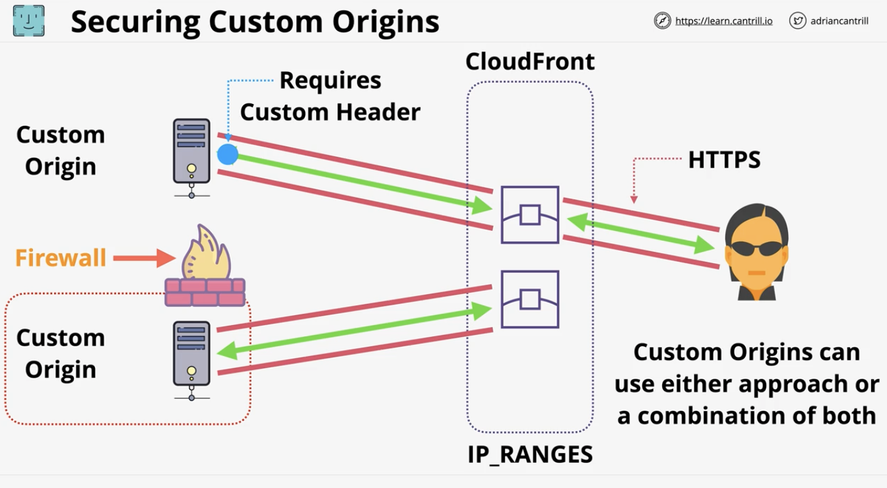
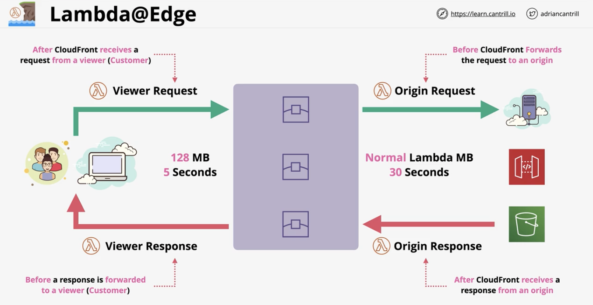
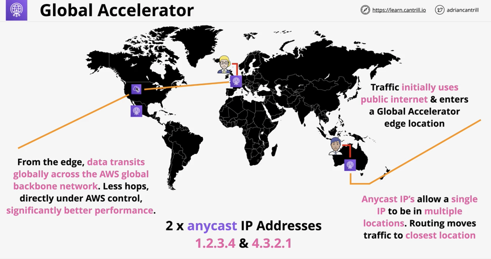

# Global content delivery and optimization 

### Cloudfront architecture 
- Overview:
  - Content Delivery Network 
- Key terms:
  - Origin - original location of content 
    - S3 origin or Custom Origin 
  - Distribution - the 'configuration' unit of cloudfront
  - Edge location - local cache of your data 
  - Regional Edge Cache - larger version of an edge location. Provides another layer of caching
    - Only custom origin can use this. No S3 origin 
- Architecture: 
  - Integrates with ACM for HTTPS
  - Uploads go direct to origin. No caching of uploads. Only reading operations add to the cache 
  - 

### Cloudfront behaviors
- All caching controls are set on a behavior 
- Restrict viewer access is also set on a behavior
- A distribution can have multiple behaviors. It can have a default 
- Default behavior is lowest priority 
- 

### Cloudfront TTL and Invalidations
- Overview:
  - How to resolve errors if there's a change with an object in origin, but the cache still contains the outdated object
  - Responses:
    - 304: Not modified
    - 200: OK
- Object Validity 
  - TTL (time to live period)
  - More frequent cache HITS = lower origin load 
  - Default TTL (behavior) = 24 hours (validity period) 
    - 24 hours from the object being added in a cache, it's viewed as expired
    - Applies to any object that doesn't have a specific max/min TTL 
  - Can set a minimum TTL and maximum TTL values 
    - Can set a per-object TTL
  - Origin Headers:
    - Cache-Control max-age (seconds)
    - Cache-Control s-maxage (seconds)
    - Expires (Date & time)
    - Headers can be set with custom origin or S3 (via object metadata)
  - Cache invalidations
    - Cache invalidation is immediately expire any object regardless of their TTL based on the invalidation pattern specified 
    - Performed on a distribution
      - Applies to all edge locations (takes times) 
    - Versioned file names: whispers1_v1.jpg // _v2.jpg // _v3.jpg
      - Pro: Changed the name of the referenced object, so no overlap 
      - Pro: Logging is more effective because know which object was used 
      - Pro: Keep all versions of the object, so consistent between edge locations 
        - thus, cheaper because don't need to do invalidations 

### ACM
- Overview:
  - AWS Certificate Manager (ACM)
  - The regions where ACM is being used must have certificates created by the same region 
  - Data in transit:
    - HTTP - simple and insecure
    - HTTPS - SSL/TSL layer of encryption added to HTTP, thus the data is:
      - encrypted in-transit 
      - Certificates prove identity 
      - Signed by a trusted authority 
    - Create, renew, and deploy certificates with ACM 
    - Supports AWS services ONLY (e.g. cloudfront and Application Load Balancer (ALB).. not EC2 or Lambda)
      - If not managed service, then ACM doesn't support it
      - (e.g. if self-managed service, like EC2, then ACM doesn't support it)
- Architecture:
  - 
  - Certificates are located in the edge locations and on the origins and supported services

### Cloudfront and SSL/TLS
- Overview:
  - Cloudfront default domain name (CNAME)
  - SSL supported by default under *.cloudfront.net cert 
    - Alternate domain names (CNAMES) e.g. cdn.catagram
  - Verify ownership (optionally HTTPS) using a matching certificate
  - `Generate or import an ACM in us-east-1`
    - Cloudfront is global service, so needs to be in us-east-1
  - HTTP or HTTPS, HTTP -> HTTPS, HTTPS only (HTTP connections will fail)
  - Two SSL connections:
    - Viewer -> CloudFront
    - CloudFront -> Origin 
    - `Both SSL connections need valid public certificates and intermediate certs`
      - Self-signed do not work 
- Cloudfront and SNI:
  - SNI is a TLS extension, allowing a host to be included 
  - Resulting in many SSL Certs/Hosts using a shared IP
  - SNI is free as part of the service 
  - Old browsers don't support SNI (CF charges extra for dedicated IP $600/month)
- Cloudfront SSL/SNI Architecture:
  - Cannot use self-signed certificates. Only publicly trusted certificates can be applied to CloudFront distributions 
  - Origin Protocol:
    - S3 Origins handle certificates natively 
    - Application Load Balancer: needs a cert that's generated externally or use ACM to generate one
    - Custom origins/on-premise servers aren't supported by ACM. Need to apply certs manually
      - On Cloudfront, cert needs to match the DNS name of the origin 
      - On the origin, the cert needs to match the DNS name of CloudFront
      - aka two way street trust on the origin and CloudFront 
  - 

### Origin Types and Origin Architecture 
- Custom Origin Differences:
  - Choose HTTP/HTTPs port
    - S3 is default to 80 and 443 respectively
  - Choose Protocol Policy (HTTP only, HTTPS only, Match viewer)
    - S3 is default to match viewer

### Securing CF (on the origin side) and S3 using OAI (Origin Access Identity)
- Overview:
  - Only S3 applicable 
  - OAI is a type of identity 
  - Can be associate with CloudFront distributions
  - Cloudfront 'becomes' that OAI 
  - OAI can only be used in S3 bucket policies 
  - DENY all BUT one or more OAIs
    - Common practice is lock down an S3 origin, so it's only accessible via CloudFront
    - So, OAI is explicitly allowed access to bucket, but everything is implicitly denied 
- Architecture for S3 Origins:
  - When the distribution is associated with the OAI, then the edge locations also take on this identity 
  - Thus, the Bucket Policy implicitly denies everything, except for the OAI 
  - As a result, the Edge Locations via OAI are allowed to access the bucket policies 
    - The user/client cannot access the bucket directly (because not part of the OAI)
  - 
- Architecture for Custom Origins
  - `Because these are custom origins, can't use Origin Access Identities`
  - Method 1: Use custom headers to secure these origins 
    - At the edge location, custom headers are injected into the data pushed towards origin (from client)
    - Then the origin is specifically looking for this header to verify that it came from the edge location 
  - Method 2: Traditional security methods
    - AWS publicize IP addresses of all services, so can determine IP ranges of Cloudfront edge locations 
    - Then, use a firewall around the Custom origin to allow only connections from the edge location and deny anything else
  - 

### Lambda@Edge
- Overview:
  - Run lightweight lambda at edge locations
  - Adjust data between Viewer and Origin
  - Currently only supports Node.js and Python
  - Run in the AWS public Space (not VPC)
  - Lambda Layers not supported)
  - Different limits vs Normal Lambda Functions
    - Functions have different size and execution time limits compared to normal lambda
- Architecture:
  - 
  - Types of requests:
    - Viewer Request: 
      - After CF receives a quest from a viewer
    - Origin Request:
      - Before CF forwards request to an origin 
    - Origin Response: 
      - After CF receives a response from an origin 
    - Viewer Response: 
      - Before a response is forwarded to a reviewer
  - To help remember the before/after for each request, 
    - the lambdas are done on the CF environment with respect to the viewer/origin
- Use cases:
  - A/B testing - Done on Viewer Request  
  - Migrations between new/old S3 Origins - Done on Origin Request 
  - Different objects based on device - Done on Origin Request 
    - e.g. different object sizes/quality levels (like images on mobile vs desktop)
  - Content by Country - Origin Request

### Global Accelerator 
- Overview:
  - The problem:
    - If a server is in one location, 
      - that means that users near the server have great customer experience
      - But users far from the server have a poor experience because of internet hops
  - Anycast IPs:
    - This allows a single IP to be routed to multiple physical locations
    - Routing moves traffic to the closest location 
    - e.g. IP 1.2.3.4 can be routed to locations A, B, and C
- Architecture:
  - A customer's traffic initially uses public internet (like Anycast IPs) and enters a global accelerator edge location
  - From each edge location, data transits globally across the AWS global backbone network.
    - This means less hops directly under the AWs control, which means significantly better performance
  - 
- Key concepts:
  - Similar to Cloudfront because they both:
    - Move the AWS network closer to the customer
    - Difference:
      - CloudFront moves the `cache locations` closer to the customer, vs
      - Global Accelerator moves the `network` closer to the customer 
        - Connections enter at edge using anycast IPs
        - Transit over AWS backbone to 1+ locations 
  - Global Accelerator is a network product:
    - Can be used for NON HTTP/S (e.g. works on TCP/UDP applications), such as web apps
    - Comparingly, CloudFront only caches HTTP and HTTPs content 
  - `Global Accelerator does not cache anything`
    - Does not cache content, network data
    - Does not understand HTTP or HTTPS
