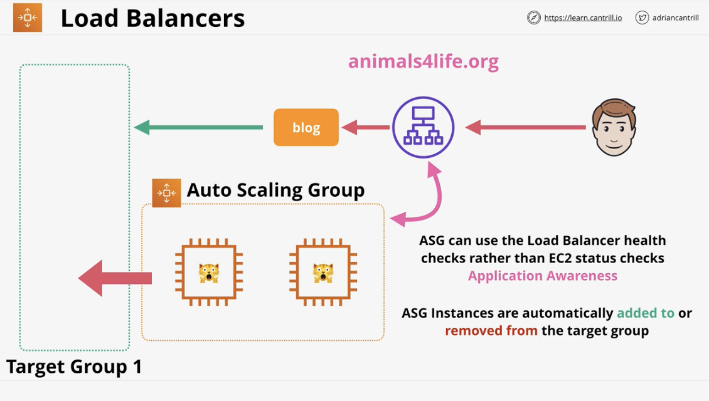
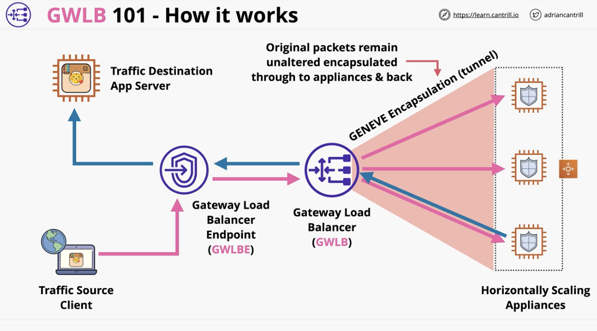
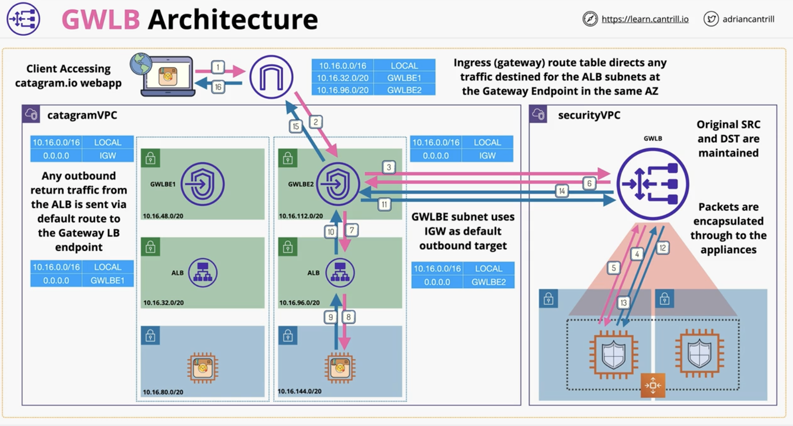

# High Availability and Scaling

### Load Balancing Fundamentals 
> - Exam powerup:
>  - Clients connect to the Load Balancer
>    - specifically the listener of the LB
>  - The LB connects on your behalf to 1+ targets (servers)
>  - 2 connections to listener and backend
>  - LB abstracts the individual servers from the client 
>  - Used for HA, fault tolerance, and scaling

### Application Load balancing (ALB)
- Overview:
  - ALB is a layer-7 LB - understands HTTP/S
  - Scalable and highly available 
  - Internet facing or internal 
    - depends on if the nodes have public facing IP addresses or not 
  - Listens on the outside -> sends to target(s) or target groups
  - Hourly rate and LCU (LB capacity unit) rate 
- LB Architecture in AWS
  - Cross-Zone load balancing - 
    - Any node can distribute to any instances that are connected to other load balancers, even if they're in another AZ
  - LB node can distribute to any 
  - Health Checks:
    - if an instance is unhealthy, then the LB doesn't connect the application to the faulty server 
  - Rules:
    - Different rules can point to different target groups
- Exam powerup:
  - Targets: single compute resources that connections are connected towards 
  - Target groups (groups of targets), which are addressed using rules 
  - Rules are path based or host based
  - Support EC2, ECS, EKS, Lambda, HTTPS, HTTP/2, and websockets
  - ALB can use SNI (Server Name Indication) for multiple SSL certs - host based rules
  - Recommended to use ALB (not Classic Load Balance which is legacy)
  - 

### Launch Configuration (LC) and Templates (LT)
- Overview: 
  - Allow you to define the config of an EC2 instance in advanced
    - e.g. AMI, instance type, storage, key pair
    - networking security groups
    - userdata & IAM role 
  - Both are NOT editable. Defined once. LT has versions, but not with LC 
  - LT provides newer features, including T2/T3 unlimited, placement groups, capacity reservations, elastic graphics 
  - LT are newer and should be used 
- Architecture:
  - LC 
    - Used in auto-scaling groups 
    - Not editable 
    - No versioning 
    - Can't be used to launch instances 
  - LT 
    - Can also be used in auto scaling groups 
    - Can also launch Ec2 instances 
      - Saves time when provisioning EC2 instances from the console UI/CLI
    - 

### Auto-Scaling Groups
- Overview: 
  - Automatic scaling and self-healing for EC2
  - Uses launch templates or launch configs
  - Important values:
    - Minimum size
    - Desired size
    - Maximum size
    - (e.g. 1:2:4)
  - Auto-scaling group provisions or terminates instances to keep at the desired level (between min and max)
    - either done manually or automatically 
    - Scaling policies automate # of instances based on metrics 
- Architecture:
  - Auto-scaling group will do its best to set the capacity as close to or at the desired capacity 
    - These new instances will be made based on the launch template provided to EC2
- Scaling policies:
  - OPTIONALLY DEFINED IN ASG
  - Manual scaling: manually adjust the desired capacity
  - Scheduled scaling: time based adjustment (e.g. sales or working hours)
  - Dynamic scaling (conditional scaling):
    - Simple: Reacts to a set conditional e.g. "CPU above 50% +1", "CPU below 50% -1"
    - Stepped: bigger +/- based on difference. React in more exterme way
      - Usually preferable to Simple scaling 
    - Target tracking: desired aggregate CPU = 40%, then ASG handles it 
      - Done to maintain a metric 
  - Cooldown period: defines how long to wait after a scaling operation was done 
    - like a buffer or grace period 
    - Keeps costs down because there's a minimum launch cost associated with launching a new EC2 instance 
- Load balancers:
  - 
- Final points: 
  - ASG are free
  - Only billed for the resources that are billed 
  - Use cool down periods to avoid rapid scaling 
  - Think about more, smaller instances because this gives you more granularity 
  - Use ALBs with ASG for elasticity - abstraction 
  - ASG defines WHEN and WHERE, launch template (LT) defines WHAT 

### Network Load Balancing (NLB)
- Overview: 
  - Allocated with a static IP address 
  - NLB's are layer-4. Only understand TCP and UDP 
  - Can't understand HTTP/S, but the connections are much faster ~100ms vs 400ms for application LBs
  - Rapid scaling - millions of requests per second 
    - Best performance of all LBs
  - 1 interface w/ static IP per AZ. Can use Elastic IPs (**whitelisting**) 
  - Can do SSL pass through 
  - Can load balance non HTTP/S applications - doesn't care about anything above TCP/UDP

### SSL Offload & Session Stickiness 
- SSL Offload:
  - Bridging (default)
    - Connecting from client to `ELASTIC LB`:
      - Listener is configured for HTTPS
      - Connection is terminated (decrypted) on the ELB & needs a (SSL) certificate for the domain name 
    - From ELB to servers:
      - ELB initiates a new SSL connection to the backend instances
      - Instances need SSL certificates and the compute require for cryptographic operations 
      - Pros:
        - ELB can see the request in plaintext and make decisions based on that 
      - Cons:
        - Cert needs to be stored on the ELB itself
        - Each EC2 needs the cert to decrypt
        - And, each EC2 instance needs the ability/compute power for cryptography
  - Pass-through
    - ELB does not decrypt 
    - Each instance needs to have the appropriate SSL cert installed
    - Listener is configured for TCP. No encryption or decryption is happening on the `NETWORK LB`
    - Connection is passed to the backend instead
    - Pros:
      - With this architecture, there is no certificate exposure to AWS since all are self-managed and secured
    - Cons:
      - No load balancing based on the HTTP part of the request because it's encrypted to the NLB
      - All instances need cryptographic compute functionality
      - All instances need SSL cert
  - Offload 
    - Clients connect to LB using HTTPS via `ELASTIC LB`
    - Client to LB:
      - Listener is configured for HTTPS
      - Connections are terminated and then backend connections from the LB use HTTP
    - ELB to backend:
      - ELB to instance connections use HTTP
      - No certificate or cryptographic requirements from the EC2 instances 
      - Data sent in plaintext
    - Pros:
      - Each instance doesn't need cryptographic compute 
      - Each instance doesn't need the SSL cert
      - Reduce per instance overhead
      - Only LB requires SSL cert
    - Cons:
      - Data is in plaintext form across AWS' network 
  - Connection Stickiness
    - With no stickiness, 
      - connections are distributed across all in-service backend instances
      - unless application handles user state, this could cause user logoffs shopping cart losses
      - Without stickiness, the application and backend would be `stateless`
    - Enabling stickiness:
      - Generates a cooking which locks the device to a single backend instance for a duration
        - Duration can be 1 second to 7 days 
        - Cookie is sent to client
      - Will keep happening unless:
        - A server fails, then the user will be moved to a different EC2
        - A cookie expires, then the whole process will repeat (e.g. get a new cookie and new backend instance)
    - Problem:
      - Can cause un-even load on a single server 

### Gateway Load Balancer
- Why do we need a GWLB?
  - Without it, there's no ingree/egree security scan
  - Transparent security application scans data after it leaves and before it enters the application instance 
  - Network security at scale
- Overview:
  - This helps you run and scale 3rd party applications
    - such as firewalls, intrusion detection, and prevention systems 
  - Inbound and outbound traffic (transparent inspection and protection)
    - GWLB endpoints helps to manage traffic as it enters/leaves via these endpoints 
    - GWLB also balances across multiple backend applications 
  - Traffic and metadata is tunnelled using GENEVE protocol 
- How it works:
  - 
  - Maintains the stickiness/state of a client's traffic 
- Example architecture:
  - 
