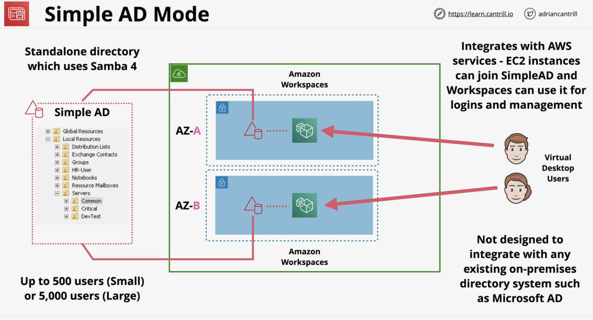
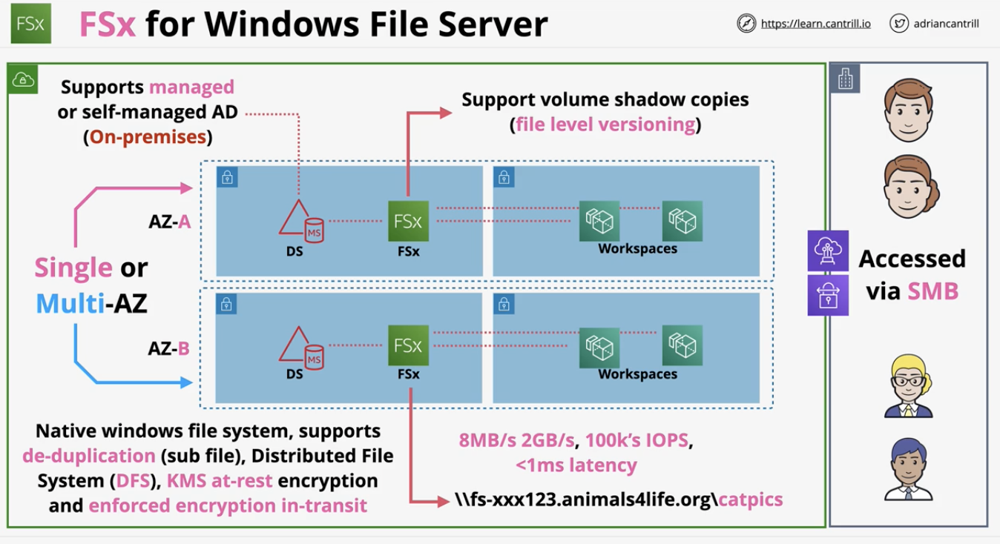

# Hybrid Environments and Migration 

### AWS Site-to-Site VPN
- Overview:
  - Need to focus on when and where to use VPN 
  - This is a logical connection between a VPC and an on-premises network encrypted used IPSec, running over public internet
  - Full HA - if designed and implemented correctly 
  - Quick to provision in less than an hour 
  - Components:
    - VPC 
    - Virtual Private Gateway (VGW)
      - target on one or more gateways 
      - highly available because have multiple endpoints in different AZs 
    - Customer Gateways 
    - VPN Connection itself between VGW and CGW 
- Architecture:
  - Single point of failure is the on-premises Customer Gateway, thus to make it HA, need 2 CGW 
  - 
- VPN Considerations:
  - Speed limitation of 1.25Gbps
    - AWS limit
  - Latency may be inconsistent since using public internet 
  - Cost:
    - AWS hourly cost
    - GB out cost
    - Data cap (on premises)
  - Speed of setup takes hours or less. All software configuration 
  - Dynamic VPN need BGP support 
  - Can be used as a backup for Direct Connect (DX)
  - Can be used with Direct Connect (DX)

### Direct Connect
- Overview:
  - A 1Gpbs or 10Gpbs network port into AWS
    - At a DX location (1000-BASE-LX for 1Gbps or 10GBASE-LR for 10Gbps)
    - To your customer router (required VLANS and BGP)
    - or Partner router (if extending to your location)
  - TL;DR: this is a `physical connection` from the AWS managed DX port all the way through to your network (on-premises)
  - Multiple virtual interfaces (VIFS) over one DX
    - Private VIF (VPC) to connect to virtual private gateway 
    - Public VIF (Public Zone Services) to connect to AWS public zone services (S3, sns, sqs, dyanmo)
- Architecture:
  - Physical connection from Physical port to Customer/Partner router in the DX location
  - Then from this router, physically connect this route from the on-premises. 
  - Pro:
    - Low consistent latency and high speeds
  - Cons:
    - No HA and no encryption because it's one single, physical cable
    - Can take weeks/months for physical cable installation
  - 
- Direct Connect Considerations:
  - Takes MUCH longer to provision than a VPN 
    - DX port provisioning is quick, but the cross-connect takes longer 
    - Then an extension to premises can take weeks/months
  - Use VPN first, then replace wiht DX (or leave it as a backup) 
  - Faster 40Gbps with aggregation 
    - 10Gbps per port
    - (compared to 1.25Gbps limit with VPN)
  - Provides low consistent latency, doesn't use business bandwidth 
  - `NO ENCRYPTION`
- DX Encryption
  - Not encrypted by default 
  - To get around this, can use public VIF that's connected to the Virtual Private Gateway's endpoints from previous section

### Direct Connect Resilience 
- Overview:
  - Each port, router, physical connection, physical building is a point of failure 
  - Therefore, duplicate as much as possible to make it resilient to faillure 
- 

### Transit Gateway 
- Overview:
  - Network transit hub to connect VPC to on-premises networks
  - Significantly reduces network complexity
  - Single network object - HA and scalable 
  - Attachments to other network types 
  - Valid attachments: VPC, site-to-site, and direct connect gateway 
- Architecture without Transit Gateway: 
  - Every single VPC needs to connect with each other
    - Need duplicates as well to increase resilience and make it highly available 
  - The larger the network, the more complex and higher overhead is needed
    - Scaling only increases complexity 
- Architecture with Transit Gateway:
  - 
- Considerations:
  - Supports transitive routing (via route tables)
  - Can be used to create global networks by peering different transit gateways
  - Share products and services between accounts using AWS RAM 
  - Peer with different regions (same or cross account)
  - Less complexity compared to not using the Transit Gateway 
  - 

### Storage gateway
- Overview:
  - Hybrid storage virtual appliance 
  - Extension of file and volume storage into AWS 
  - Tape backups into AWS 
  - Migration of existing infrastructure to AWS 
- 3 Modes:
  - Tape Gateway (VTL) Mode
    - Virtual tapes moves to S3 and Glacier 
    - Architecture:
      - Pretends to be a iSCSI tape library, changer, and drive 
      - Active tapes stored in S3, archived/exported tapes stored in VTS in Glacier 
      - Unlimited VTS storage 
  - File Mode
    - SMB and NFS (common file sharing protocol 
    - File storage backed by S3 objects)
    - Architecture:
      - File gateway is a super large file server, but instead of storing files on local storage, it's in S3 as objects
  - Volume Mode (Gateway cached/stored) - iSCSI
    - `Block storage` backed by S3 and EBS snapshots
    - Architecture for Stored:
      - Primary data is `stored on-premises`
        - backup is asynchronously replicated to AWS 
        - AWS side creates EBS snapshots from backup data
        - Can be used to create standard EBS volumes
      - Use for: migrations & disaster migrations to AWS 
    - Architecture for Cached:
      - Primary data is `stored in AWS` 
        - Data which is access frequently is cached locally
        - Primary data is stored on a S3-backed volume (AWS managed bucket)
        - Snapshots are stored as standard EBS snapshots 
      - Use for: extending storage into AWS & want to decommission from on-premises

### Snowball/Edge/Snowmbile
- Overview:
  - Designed to move large amounts of data IN and OUT of AWS 
  - Physical storage (suitacse or truck)
  - Ordered from AWS:
    - Empty, load up, return
    - With data, empty, return 
  - Need to know which to use..
- Snowball:
  - Ordered from AWS, log a job, device delivered (not instant)
  - Data encryption uses KMS 
  - 50TB or 80TB capacity 
  - 1 Gbps or 10Gbps 
  - 10TB to 10PB economical range (multiple devices) 
    - Can order multiple devices and sent to different premises 
  - Only storage (no commute)
- Snowball Edge
  - Comes with both storage and compute 
  - Larger capacity compared to snowball 
  - 10Gbps, 10/25, 45/50/100 Gbps
  - Types of snowball edge:
    - Storage optimized (with EC2)
    - Compute optimized 
    - Compute with GPU 
  - Use for: 
    - remote sites or where data processing on ingestion is needed 
    - newer than snowball 
- Snowmobile
  - Portable datacenter within a shipping container on a truck 
  - Special order from AWS 
  - Use for: single location when 10PB+ is required 
    - Can store up to 100PB per snowmobile
    - Not economical for multi-site (unless huge) or sub 10PB of data

### Directory Service
- Overview:
  - AWS Managed implemention of a directory
  - Runs within a VPC 
  - To implement HA, need to deploy into multiple AZs 
  - Some AWS services NEED a directory (e.g. Amazon Workspaces)
  - Methods of connection:
    - isolated
    - integrated with existing on-premises system 
    - act as a 'proxy' back to on-premises
- Types of Directory Service:
  - Simple AD Mode
    - Standalone directory which uses Samba 4 (open source)
    - Integrates with AWS services 
    - Designed to be run in isolation:
      - Not designed to integrate with any on-premises system 
    - 
  - AWS Managed Microsoft AD
    - Use for: 
      - Want a direct presence inside AWS, but also have existing on-premises environment with Microsoft active directory 
    - 
  - AD Connector 
    - Use for:
      - act as a 'proxy' between AWS and back to on-premises directory
      - Does not provide authentication
    - 
- Picking between modes
  - Use Simple AD for:
    - The go-to/the default
    - It has simple requirements and it's a directory in AWS
  - Use Microsoft AD (active directory) for:
    - applications in AWS which need Microsoft active directory directory service, or
    - application needs to trust active directory directory service 
    - Note: this is an actual Microsoft directory
  - Use AD connector for: 
    - Need to use AWS services which need a directory, but you don't want to store any directory info in the cloud
    - Want to proxy to your on-premises directory

### Data Sync
- Overview:
  - ELECTRONIC DATA TRANSFER 
    - Compared to physical transfer via snowball 
  - Data transfer service TO and FROM AWS 
  - Use for: 
    - Migrations, data processing transfer, archival/cost-effective storage, or disaster recovery/business continuity
  - Designed to work at huge scale 
  - Keeps metadata (e.g. permissions and timestamps)
  - Built in data validation 
- Key features:
  - Communicates over NFS or SMB with on-premises storage
  - Scalable (10Gpbs per agent or ~100TB per day)
  - Bandwidth limiters (avoid link saturation)
  - Incremental and scheduled transfer options
  - Compression and encryption 
  - Automatic recovery from transit errors 
  - AWS service integration - S3, EFS, FSx
  - Pay as you use .. per GB cost for data moved
- Architecture:
  - 
  - Task: 
    - A 'job' within datasync
    - Defines what is being synced, how quickly, FROM where and TO where
  - Agent:
    - Software used to read or write to on-premises data stores using NFS or SMB
  - Location:
    - Every ask has two locations: FROM and TO
    - e.g. Network File System (NFS), server message block (SMB), Amazon EFS, Amazon FSx, and S3

### FSx for Windows Servers
- Overview:
  - Fully managed native Windows file servers/shares 
  - **Designed for integration with Windows environments** 
  - Integrates with directory services or self-managed AD 
  - Single or multi-AZ within a VPC 
  - On-demand and scheduled backups 
  - Accessible using VPC, Peering, VPN, Direct Connect 
- Architecture:
  - 
- Key Features and Benefits:
  - VSS - User-driven restores on files and folders
  - Native file system accessible over SMB 
    - Compared to, EFS uses network file server protocol 
  - Uses Windows permission model 
  - Supports DFS (distributed file system) -> scale-out file share structure 
  - Managed - no file server admin 
  - Integrates with DS AND your own directory

### FSx for Lustre
- Overview:
  - Managed Lustre - designed for HPC - LINUX clients (POSIX style systems)
  - Machine learning, big data, financial modelling
  - 100's GB/s throughput and sub millisecond latency 
  - Deployment types - persistent or scratch:
    - Scratch - 
      - highly optimised for short term
      - no replication
      - fast
    - Persistent - 
      - longer term
      - HA (in one AZ)
      - self-healing
  - Accessible over VPN or direct connect 
- Architecture:
  - Data is lazy-loaded into the lustre file system. 
    - Data isn't actually stored in the file system until it's accessed from S3 
  - 
- Key points:
  - Scratch is designed for pure performance 
    - Short term or temporary workloads 
    - No HA and no replication 
    - Larger file system means more servers, more disks, and more chance of failures
  - Persistent 
    - Has replication within `ONE AZ only`
    - Auto-heals when hardware failure occurs 
  - You can backup to S3 with both (manual or automatic 0-35 day retention)