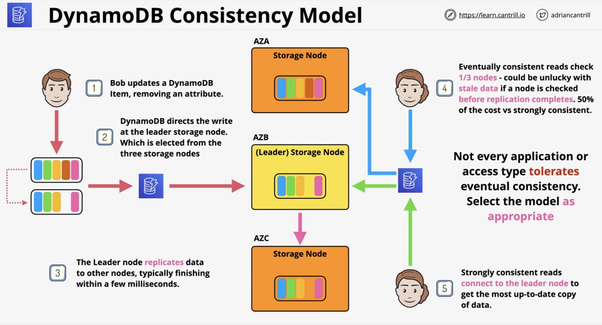
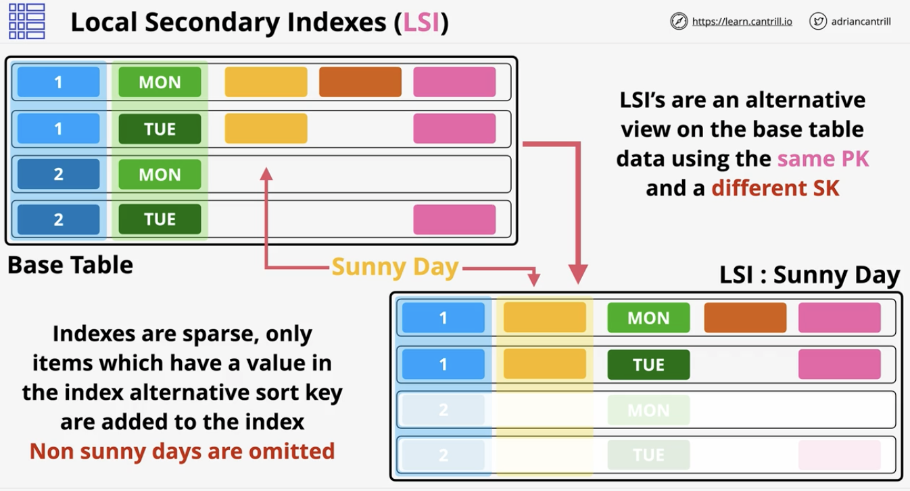
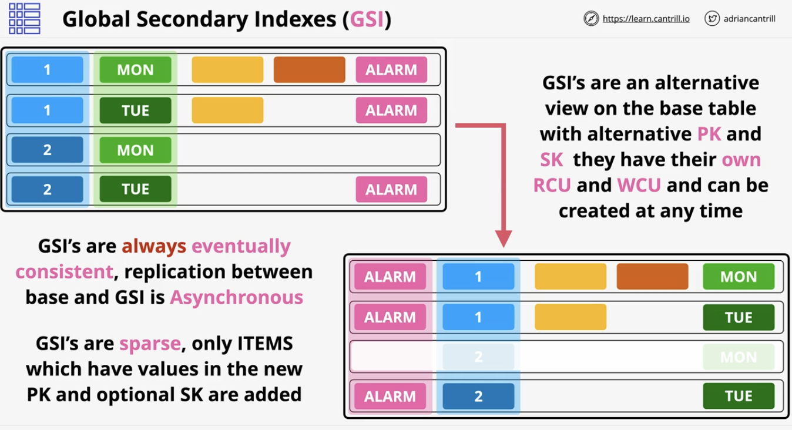
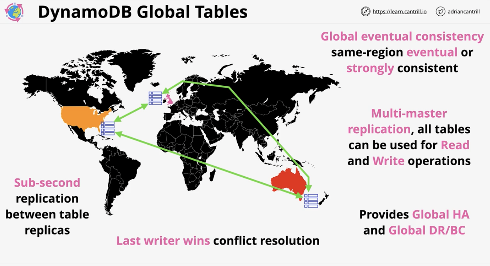
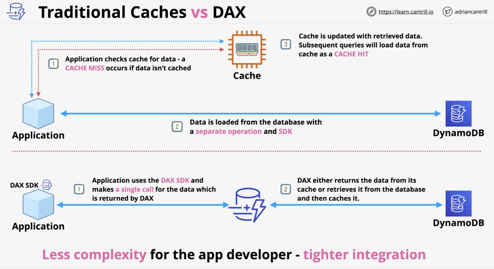
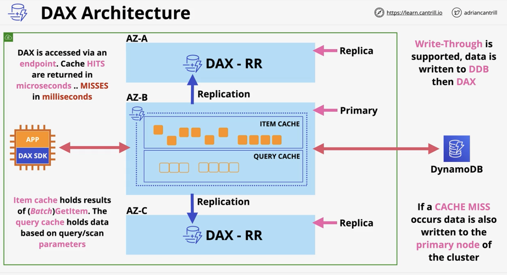
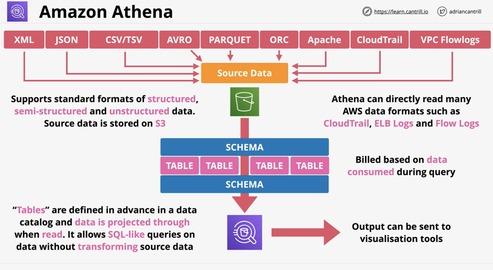
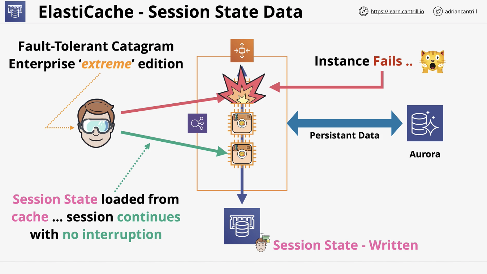
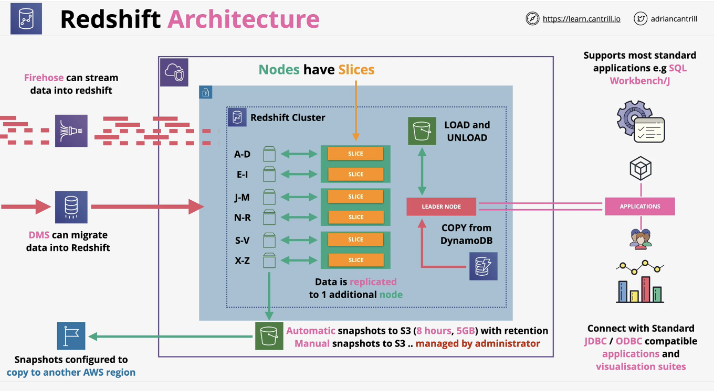
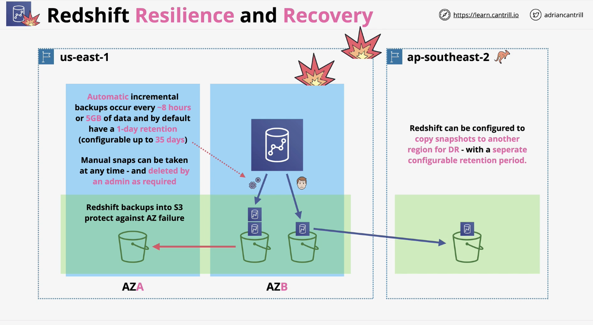

# NoSQL Databases and DynamoDB

### DynamoDB - Architecture
- Overview: 
  - NoSQL
  - Public DS as a service (DBaaS)
  - Key/Value & Document 
  - No self-managed servers or infrastructure 
  - Highly resilient across AZs and optionally globally resilient 
  - Really fast (ssd based) 
  - back-ups, point-in-time recovery, encryption at rest
  - Event-Driven integration - do things when data changes 
- Tables:
  - Table: grouping of items with the same PRIMARY KEY 
  - PRIMARY KEY types:
    - Partition Key: Simple (one value)
    - Sort Key: Composite (two values joined together) 
  - Row: each item much have unique value for PK and SK
    - Can have none, all, mixture, or different attribute 
- Backups
  - On-demand: 
    - Full copy of table; retained until removed 
  - Point in time recovery:
    - Continuous record of changes allows replay to any point in the window 
    - Not enabled by default 
    - Per table basis
- Key terms:
  - "NoSQL" -> likely DynamoDB
  - Relational Data -> generally NOT DynamoDB
  - Key/Value -> likely DynamoDB
  - Access via console, CLI, API 
    - No SQL 
  - Billing based on RCU, WCU, Storage, and features

### DynamoDB - Operations, Consistency and Performance
- Overview:
  - On-demand - unknown, unpredictable, low admin
  - Provisioned - RCU and WCU set on per table basis
  - Every operation consumes at least 1 RCU/WCU
  - 1 RCU is 1 x 4KB read operation per second
  - 1 WCU is 1 x 1KB write operation per second 
  - Every table has a RCU and WCU burst pool (300 seconds) 
- Query:
  - Pick 1 partition key value 
  - Capacity consumed is the size of all returned items 
    - Capacity is still consumed if discarding filtered data 
  - Better/more efficient to query back as many items as possible 
- Scan:
  - Least efficient method to get data from DynamoDB, but most flexible 
  - SCAN moves through a table consuming the capacity of every item 
  - However, you have completely control on what data is selected, any attribute can be used and filters applied, 
    - BUT scan consumes capacity for EVERY ITEM scanned through 
- Consistency Modes:
  - Consistency is whether data being read after writing will be the updated or eventually updated
  - Eventually consistent vs Strongly consistent 
  - Architecture:
    - 
- WCU Calculation
  - WCU is per second usually
  - WCU = ceil(ITEM_SIZE/1 KB) * AVG_NUMBER_OF_ITEMS_PER_SECOND
- RCU Calculation
  - RCU is per second usually
  - Strongly consistent RCU = ceil(ITEM_SIZE/4 KB) * AVG_NUMBER_OF_ITEMS_PER_SECOND
  - Eventually consistent RCU = 5 RCU (50% of strongly consistent)

### DynamoDB Local and Global Secondary Indexes
- Overview:
  - Query is most efficient operation in DDB, but 
    - `Query can only work on 1 PK value at a time`
    - And optionally a single, or range of SK values 
  - Indexes are alternative views on table data. Types of Indexes:
    - Local Secondary Index (LSI): create a view using different SK 
    - Global Secondary Index (GSI): Create view with a different PK and SK 
  - With indexes, can choose some or all attributes (projection) 
- Local Secondary Indexes:
  - Alternative view for a table
  - `MUST be created with a table`
  - Limitation: only 5 LSI's per base table
  - `LSI allow for alternative SK on the main table, but same PK`
  - `Shares the RCU and WCU with the main table`
  - Architecture:
    - Indexes are sparse, only items which have a value in the index alternative sort key are added to the index 
    - 
- Global Secondary Indexes:
  - Can be created at any time 
  - Default limit of 20 per base table 
  - Alternative PK and SK 
  - `GSI's have their own RCU and WCU allocations`
  - Attributes - all, keys_only, & include 
  - Architecture:
    - GSIs are sparse as well 
    - 
- LSI and GSI considerations:
  - Careful with projections (KEYS_ONLY, INCLUDE, ALL)
  - Queries on attributes NOT projects are expensive 
  - Use GSIs as default, and only use LSI only when STRONG CONSISTENCY is required
  - Use Indexes for alternative access patterns

### DynamoDB - Streams & Lambda Triggers
- Overview:
  - Stream is a time-ordered list of **item changes** in a table
  - It's a 24 hour rolling window
  - Enabled per table basis
  - Records inserts, updates, and deletes 
  - Different view types influence what is in the stream 
- Architecture:
  - View types for a stream:
    - KEYS_ONLY: PK and SK keys only
    - NEW_IMAGE: View state of the item after the change 
    - OLD_IMAGE: View state of the item before the change 
    - NEW_AND_OLD_IMAGES: View both states of the item before and after the change 
  - Works for inserts, updates, and deletes. 
    - Some states may be blank depending on inserts or deletes if an item is new or completely deleted
- Trigger Concepts:
  - Item changes generates an event
  - That event contains the data which changed 
  - An action is taken using that data 
  - In AWS, then means using Streams and Lambda to make an event 
  - Used for:
    - reporting & analytics 
    - Aggregation of data, messaging, or notifications 
  - Architecture:
    - Item change occurs in a table with streams enabled
    - Stream record is added into stream because of the new change 
    - Lambda function is invoked when stream events occurs. Function is passed the VIEW data as an event

### DynamoDB - Global Tables
- Overview:
  - Global tables provides multi-master cross-region replication 
  - Tables are created in multiple regions and added to the same global table (becoming replica tables) 
  - `Last writer wins is used for conflict resolution` 
  - Because it's multi-master, then reads and writed can occur in any region 
  - Generally sub-second replication between regions
  - Strongly consistent reads **ONLY** in the same region as writes
    - but anything else is **always eventually consistent** 
- Architecture:
  - 

### DynamoDB - Accelerator (DAX)
- Traditional cache vs DAX
  - 
- Overview:
  - In memory cache 
  - Built in SDK with DynamoDB, so to the application, the cache and DDB are the same
    - Thus, easier on the application engineer
- Architecture:
  - Types of cache:
    - Item cache
      - Retrieved via get_item() or batch() 
      - Operate on single items and need to specify the PK and SK, if applicable 
    - Query cache
      - Stores collection of items retrieved via query or scan operations
      - Also, stores parameters used in that original query or scan 
  - 
- Key points:
  - Primary NODE (writes) and replicas (read) 
  - Nodes are HA 
    - If primary node experiences failure, then elect new primary node
  - In-memory caching == scaling. Much faster reads and reduced costs 
  - Scale UP and scale OUT (bigger or more) 
  - Supports write-through 
  - DAX deployed WITHIN a VPC
  - Use for:
    - Ready heavy or bursty workloads 
    - Care about incredibly low response times 
  - Do not use for:
    - Applications that require strongly consistent reads 
    - Applications which **aren't** latency sensitive or **do not need** fast response times
    - Applications which are write heavy or infrequently uses read operations 

### Amazon Athena
- Overview:
  - Serverless interactive querying service
  - Run ad-hoc queries on data and pay only data consumed 
  - Schema-on read - table-like translation 
  - Original data never changed - remains on S3 
  - Schema translates data into a relational-like when read 
  - Outputs can be sent to other services 
    - Can be used in event driven serverless applications 
- Architecture:
  - Define schema and how to go from source data to final table schema 
  - Schema is used at the time of reading 
  - Allows for SQL-like queries on data without transforming source data 
  - Pay for data consumed on query 
  - 

### Elasticache
- Overview:
  - In-memory database with high performance 
  - Not persistent, so only used for temporary data
  - Managed Redis or Memcached as a service 
  - Use for:
    - Cache data for READ HEAVY workloads with low latency requirements
      - Reduces database workloads, which is normally expensive to read a DB
    - Store session data (to help make stateless servers become stateful)
  - Cons: 
    - `Requires application code changes to understand the caching architecture`
- Architecture: 
  - Session State Data 
    - 
- Redis vs MemcacheD
  - |MemcacheD                      |Redis                         |
    |-------------------------------|-----------------------------|
    | Simple data structures        |Advanced structures (lists, sets, sorted sets, hashes, bit arrays, and more)|
    |No replication                 |Replication across multi-AZ|
    |Multiple nodes (sharding by storing a subset of usernames in one node and others in another)|Replication across nodes (scale reads) |
    |No backups                     |Supports backup and restores|
    |Multi-threaded (better performance with multi-core CPUs)|Transactions are atomic (all work or no operations)|

### Redshift Architecture
- Overview:
  - Petabyte-scale data warehouse 
    - Designed for huge data
  - OLAP (column based) and not OLTP (row/transaction) 
    - Typically put OLTP data into OLAP 
  - Pay as you use (similar to RDS) 
  - Direct Query S3 using Redshift Spectrum 
  - Direct query other DBs using Federated Query 
  - Integrates into AWS tooling such as quicksight
  - SQL-like interface to JDBC/ODBC
- Architecture:
  - Server based (not serverless, like Athena) 
  - Cluster is a private network 
  - One AZ in a VPC - network cost/performance
  - Leader node - query input, planning, and aggregation
    - Manages distribution of compute/data to compute node 
  - Compute node - performing queries of data 
  - Contains VPC security, iam permissions, kms at rest encyrption, CW monitoring 
  - `Redshift enhanced VPC routing - VPC networking !`
  - 
- Key things to know for exam:
  - Which products can be integrated
  - How Redshift fits into architectures
  - How to design a redshift implementation 

### Redshift DR and Resilience
- Overview:
  - 
