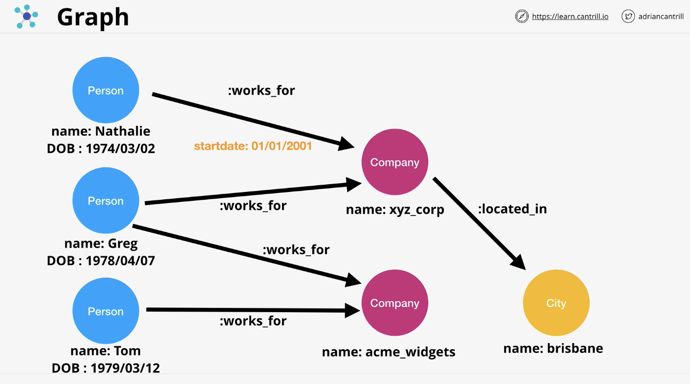

# Relational Database Service

### Database Refresher 
- Key-value storel=:
  - No scheme
  - No structure 
  - Scalable 
  - Really fast
  - Uses in-memory caching 
- Wide Column Store
  - Partition Key (primary) 
    - Every item must have this
    - Must be unique 
  - Other Key 
    - Every time must have this 
    - If this is a composite key, then this + the partition key must be unique
  - Table: a set of attributes that can be different item by item
  - DynamoDB in AWS is this type of DB
- Document Database
  - Use for: 
    - orders and contacts
    - interacting with whole documents or deep attribute interactions 
  - Documents of JSON or XWL
- Column
  - Example: Redshift 
  - All data is grouped by each field/column
  - Row vs Column:
    - Row is ideal if you are operating with rows: adding, updating, deleting 
      - Online transactions processing (OLTP)
    - Column is ideal for reporting or when all values for a specific attribute are required 
- Graph
  - 

### ACID vs BASE (11.5)
- Overview:
  - ACID and BASE are DB transactional models 
  - CAP theorem:
    - Consistency: every read to a DB will receive the most recent write (or error)
    - Availability: every request will receive a non-error response, 
                    but without the guarantee that it contains the most recent write
    - Partition Tolerant (resilience): system can be made of multiple network partitions and 
                                       the system will continue to operate, even if there are a number of dropped 
                                       messages or errors
    - Theorem states: any DB can only capable of delivering a maximum of two of these different factors
  - ACID = focus on consistency 
  - BASE = focus on availibity 
- ACID:
  - Atomic: 
    - ALL or NO components of a transaction succeeds or fails 
    - all or nothing 
  - Consistent: 
    - Transactions move the database from one valid state to another- nothing in between is allowed
  - Isolated: 
    - If multiple transactions occur at once, they don't interfere with each other. 
    - Each transaction executes as if it's the only one running on the DB
  - Durable: 
    - Once a transaction has been committed, then the transactions are durable. 
    - Stored on non-volatile memory, resilient to power, outages, or crashes
  - `Example: RDS which limits scaling`
- BASE:
  - Basically Available:
    - READ and WRITE operations are available as much as possible, but without any consistency guarantees
    - -> does its best to be consistent, but does nothing to enforce it
  - Soft State:
    - The DB doesn't enforce consistency. This is offloaded into the application/user 
  - Eventually Consistent: 
    - If we wait long enough, reads from the system will be consistent 
  - DBs that use BASE are scalable
  - `Example: DynamoDB which offers consistency`

### Databases on EC2 (13.5)
- Overview: 
  - Imagine:
    - One instance contains the webserver and application, and another contains just the database
    - Introduce a dependency to have reliable communication between the instance running the app & the db instance
    - If have the instances in different AZs, then it'll cost a lot because there's cost transferring data between AZs
- Why might want to run DBs on EC2:
  - Access to the DB instance OS 
  - Advanced DB option tuning (DBROOT)
    - Usually this is the vendor that demands this, not the client 
    - Usually not required either 
    - Vendors usually work with other AWS DB clients 
  - DB or DB version which AWS doesn't provide 
  - Specific OS/DB combination which AWS doesn't provide
  - Architecture AWS doesn't provide (replication/resilience) 
  - Decisions makers who 'just want it'
- Why you really shouldn't run a DB in EC2:
  - Admin overhead - requires significant management of the EC2 and DBHost 
  - Backup / Disaster recovery (DR) management 
  - EC2 is a single AZ (if the AZ fails, then access to the DB fails)
    - Need to take EBS snapshots and put them on long-term storage (S3)
  - Features - some of AWS DB products are amazing (and better than the DBs hosted on EC2)
  - EC2 is ON or OFF - no serverless or easy scaling or keeping up with bursty style demand
  - Replication - skills, setup time, monitoring & effectiveness 
  - Performance - AWS invests time into optimizations and features for their DBs

### Relational Database Service (RDS) Architecture (11)
- Overview: 
  - Designed for SQL 
  - Database as a service (DBaaS)
    - DatabaseServer-as-a-service
    - Pay for what you consume
  - Managed Database Instance (1+ Databases) 
    - Don't need to manage physical hardware or server operating system or the database system itself
  - Multiple engines MySQL, MariaDB, PostgreSQL, Oracle, Microsoft SQL Server... 
  - Amazon Aurora
- RDS DB Instance
  - It can contain multiple user created instances 
  - Access the DB by using the database host-name, A CNAME, and this resolves to the DB instance itself 
    - Only method to connect because there's no IP address 
  - Similar to EC2, the DBs come in different sizes and types.
    - ex: db.m5, db.r5, db.t3
  - When provision an instance, also allocated dedicated storage for that instance
    - A single AZ RDS instance has one attached piece of block storage (essentially EBS storage)
    - The storage is also located in that AZ 
    - This means: RDS is vulnerable to a failure inside that AZ 
    - This type of storage can be SSD based (GP2), or io1, or magnetic. 
      - In most cases, GP2 is default 
      - io1 offers high-end performance
      - GP2 has same burst pool architecture as on EC2 and same performance profile 
      - Magnetic is moreso for more compatibility or long-term historic uses 
  - Billing: 
    - The instance itself 
    - Amount for storage 
    - GB-per-month cost 
  - Security: 
    - Controlled via security group which is associated to that RDS instance 
      - Can use existing security group or make your own 

### RDS High-Availability (Multi AZ) (10)
- Overview:
  - In one AZ, there is a Primary RDS server
  - In another AZ, there is a Standby RDS server that holds the same data as the Primary RDS server
    - It's done via synchronous replication 
  - The Database CNAME only points to the Primary RDS server 
    - Cannot directly access the standby replica for any reason using RDS 
  - Very little lag, if any, between the replication between the primary and standby instance 
  - If an error happens with the primary instance, then RDS detects this and changes the db endpoint CNAME to the standby replica 
    - This failover happens within 60 to 120 seconds 
  - Provides high HA, but not fault tolerance 
    - There is some downtime impact during a failover 
> - Exam powerups:
>  - No free-tier: extra cost for standby replica
>    - Using extra infrastructure and constantly running
    - Costs twice the price
>  - Standby can't be directly used
>    - Availability improvement, not a performance improvement 
>  - 60-120 seconds failover 
>  - Same region only (other AZs in the VPC)
>  - DB backups taken from Standby instance (removes performance impact)
>    - e.g. backing up the database 
>  - Failover examples: AZ Outage, primary failure, manual failover, instance type change and software patching 
>  - `Synchronous replication`

### RDS Automatic Backup, RDS Snapshots and Restore (14) 
- RTO vs RPO 
  - `Recovery Time Objective (RTO)`: 
    - Time between DR event and full recovery 
    - Influenced by process, staff, tech, and documentation 
    - Generally lower value costs more 
  - `Recovery Point Objective (RPO)`: time between when the last working backup occurred and the point of failure
    - Maximum amount of data loss possible 
    - Influences technical solution & cost: Lowering RPO means more regular system backups or some form of replication
    - Gets expensive
- RDS Backups:
  - Type of backups:
    - Automatic Backups
    - Manual Snapshots
  - Both type of backups use AWS Managed S3 buckets, so you can't view them from within the S3 console 
    - Region resilient 
  - For Muli-AZ mode:
    - If enabled, then use the standby instance to create backups 
    - If disabled, then use the single db instance to create backups
- Manual Snapshots: 
  - First snap is full size of consumed data. Then future snaps = incremental 
  - If using single db instance, then this process can affect your application due to performance. 
    - But no impact if using Multi-AZ because it uses the standby db instance 
  - Manual snapshots will stay in the S3 bucket forever unless they are manually deleted 
    - Even if the RDS db is deleted, the snapshots will still remain 
- Automatic backups:
  - Same architecture as manual, but they're just done automatically
  - Every 5 minutes, database transaction logs are written to S3
  - Retention period:
    - Field can be set to 0 to 35 days. This means that logs older than the set days will be deleted
      - 0 days - no backups
      - 35 days - logs older than 35 days will be deleted 
    - If an RDS db is deleted, logs are still going to be deleted after the retention period 
> - Exam powerup:
>  - When perform a store, RDS creates a NEW RDS instance - it has a new address
>  - Snapshots = single point in time, creation time
>  - Automated = any 5 minute point in time 
>  - Backup is restored and transaction logs are "replayed" to bring DB to desired point in time
>  - Restores aren't fast - think about RTO 

### RDS Read-Replicas (9)
- Overview:
  - Asynchronous == read-replicas 
  - Synchronous == multi-AZ 
  - Can only have FIVE read-replicas 
  - Provides READing SCALING; does not do WRITE scaling 
  - How it works:
    - fully written to the primary instance first. Then after stored on disk, the data is then replicated to the Read-Replicas
  - Can be created in the same region as the primary, or different region. 
  - If it's a different region, this is called cross-region Read-Replica:
    - AWS handles all networking between regions and this occurs transparently to you 
    - Fully encrypted in transit 
- Why they matter:
  - Performance improvements:
    - 5x direct read-replicas per DB instance 
    - Each providing an additional instance of read performance, thus setting the primary instance for write only
    - Read-replicas can have read-replicas, but lag starts to be a problem 
    - Global performance improvements 
  - Availability improvements:
    - More snapshots and backups to improve RPO
    - RTO's are still a problem
    - Read-replicas offer near 0 RPO
    - Read-replicas can be promoted quickly to be a primary instance, so there's a low RTO 
      - Only works for failures; can't recover from a data corruption 
    - Read only- until promote. This process is not reversable either. 
      - To reverse, must delete it and then create a new read-replica
    - Global availability improvements -> global resilience

### RDS Data Security
- Overview:
  - Data between client and RDS is protected via SSL/TLS (in transit) is available for RDS, can be mandatory
  - RDS supports EBS volume encryption - KMS 
    - Handled by HOST/EBS
    - DB doesn't know that the data is being encrypted
  - AWS or customer managed CMK generates data keys 
    - Data keys used for encryption operations
  - Storage, logs, snapshots, and replicas are encrypted
  - Encryption can't be removed 
  - RDS MSSQL and RDS Oracle Support TDE (Transparent Data Encryption)
    - Transparent data encryption 
  - Encryption handled within the DB engine 
  - RDS Oracle supports integration with CloudHSM
  - Much stronger key controls (even from AWS) 
- IAM Authentication
  - Policy attached to Users or Roles maps that IAM identity onto the local RDS user
  - Authorization is controlled by the DB Engine. Permissions are assigned to the local DB user
  - IAM is NOT used to authorize, only for authentication 
- 

### Aurora Architecture (14)
- Overview: 
  - Very different from RDS because it uses a CLUSTER
  - A single primary instance +0 or more replicas 
    - Offers the same benefits of Multi-AZ and read-replicas for RDS 
  - Does not use local storage for compute instances. Uses cluster volume
    - This offers faster provisioning & improved availability & performance
- Architecture 
  - All SSD based - high IOPS, low latency 
  - Don't have to allocate storage to aurora cluster
  - Billed on consumption. High water mark - billed for the most used 
  - Storage which is freed up can be re-used 
  - Replicas can be added and removed without requiring storage provisioning
  - Have mulitple end-points 
    - Cluster endpoint: points to Primary instance
    - Reader endpont: points to primary + other replicas 
    - Custom endpoints
- Cost:
  - No free-tier option 
  - Doesn't support micro instances 
  - Beyond RDS singleAZ (micro), Aurora is better value
  - Compute - hourly charge, per second, 10 minute minimum
  - Storage - GB-month consumed, IO cost per request
  - 100% DB size in backups are included 
- Features:
  - Backups in Aurora work the same way as RDS 
  - Restores create a new cluster 
  - Backtrack can be used which allow in-place rewinds to a previous point in time 
    - Unique to Aurora 
  - Fast clones make a new database much faster than copying all the data: copy-on-write

### Aurora Serverless
- Overview:
  - Scalable - Aurora Capacity Units (ACU)
  - Aurora Serverless cluster has a min & max ACU
  - Cluster adjusts base don load 
  - Can go to 0 and be paused
  - Consumption billing per second basis
  - Same resilience as Aurora (6 copies across AZs) 
  - Aurora is to RDS what fargate is to ECS 
- Architecture:
  - Aurora has a pool of ACUs managed by AWS 
  - AWS essentially gives/takes ACU resources to each Aurora serverless cluster 
  - Proxy fleet:
    - Broker (middle man) a connection between the client application and aurora's ACUs
    - Managed by AWS 
  - User needs to pick the min and max ACU 
- Use cases:
  - Infrequently used applications 
  - New applications (if unsure about levels of load, so unsure about DB size)
  - Varied workloads 
  - Unpredictable workloads 
  - Development and test databases 
  - Multi-tenant applications 

### Aurora Global Database
- Overview:
  - Create up to 16 read-replicas in a different region 
  - Replication occurs at the storage layer and is generally ~1second between all AWS regions.
    - Copying from 1 region to another takes about 1 second
- When to use:
  - Cross-region Disaster Recovery and Basic Continuity 
  - Global read scaling - low latency performance improvement 
  - ~1 second or less replication between regions (primary to all secondary) 
    - 1 way replication from primary to secondary 
  - No impact on DB performance to perform the replication process because happens on the storage layer 
  - Secondary regions can have 16 replicas 
    - Can all be promoted to R/W if primary fails 
  - Currently, max of 5 secondary regions

### Multi-master writes
- Overview:
  - Default Aurora mode is single master:
    - 1 R/w and 0+ read-only replicas
    - Cluster endpoint is used to write, read endpoint is used for load balancing reads
    - Failover takes time - replica promoted to R/W
  - In multi-master mode, all instances are R/W capable 
- Multi-Master:
  - No load balancing endpoints 
  - Application can connect to one or more instances in the cluster
  - When a cluster receives a write request, it attempts to write to all of the storage nodes in that cluster
    - In this attempt, each node in the cluster must either confirm or reject the propose change:
      - accept - no other writes happening in the cluster
      - reject - another change/write is happening. Send this error back to the application 
    - If write is accepted, it's written to disk and the change it passed to other instances in the cluster
      - So that the data can be written to the instances' cache so it's updated if data is read from that instance

### Database Migration Service (DMS)
- Overview:
  - Managed DB migration service
  - Runs using a replication instance 
  - Need to define the source and destination endpoints at the
    - source and target databases
  - `One endpoint MUST be on AWS`
- DMS:
  - EC2 instance with the DMS software. Give credentials and connection information for SRC + DST DBs by creating endpoint configs
  - Between a source and dest, you define the replication tasks 
  - The replication instance performance the migration between the source and destination endpoints, which store 
    connection information for source and target endpoints 
  - Does not natively do schema conversion, but there's tools that exist in AWS that do this like SCT (Scheme Conversion Tool)
  - Types of jobs:
    - Full load: 
      - copy all data from source to destination  
    - Full load + CDC (change data capture): 
      - does full db migration from source to dest, but also captures changes in source DB 
      - after the migration is finished, then the changes captured are also applied to the target DB
      - reduces any need for downtime as would be needed for "Full Load"
    - CDC only: 
      - Use external tooling to perform initial transfer of the DB
      - Then use DMS just to capture the changes and apply them to target DB after initial migration 
      