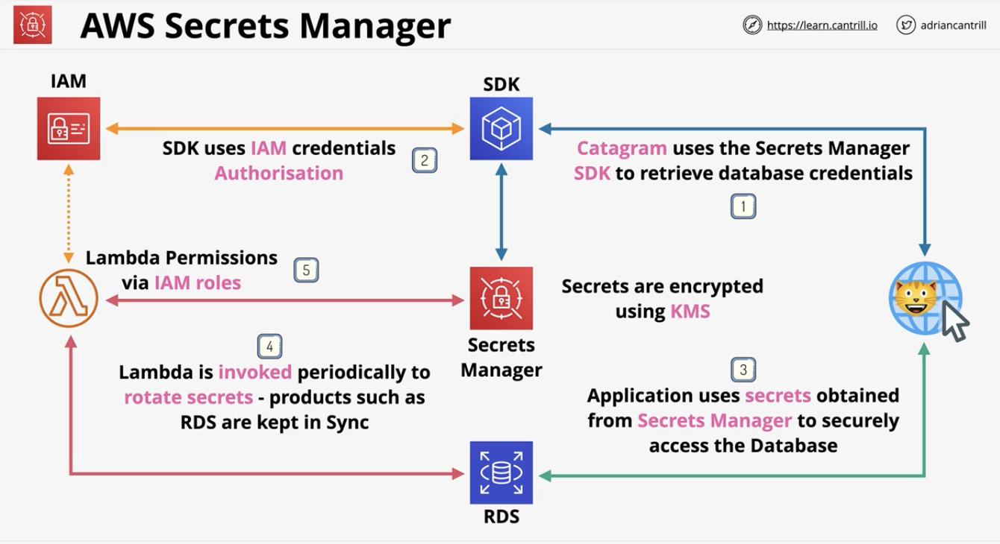
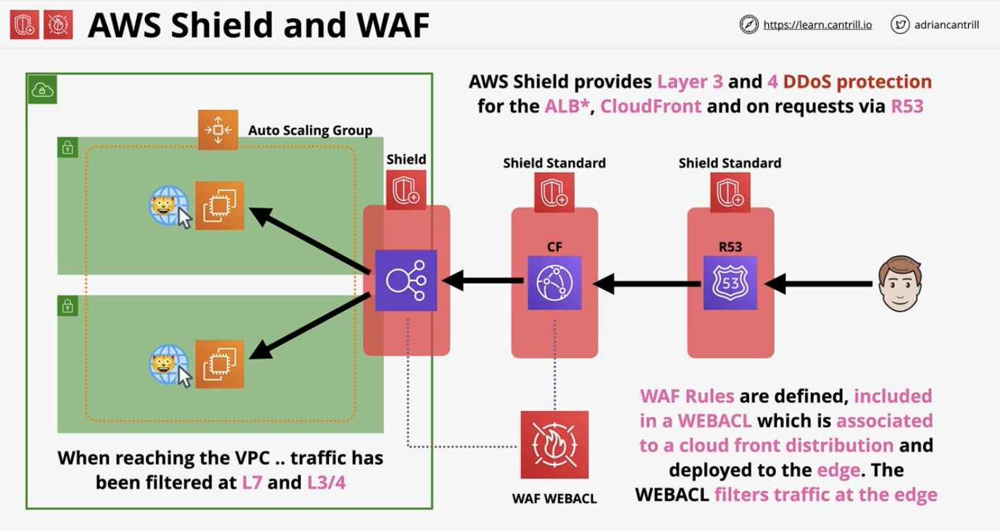
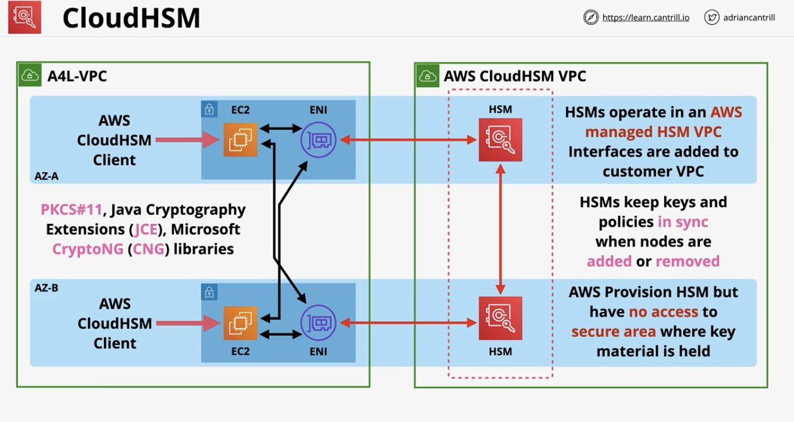
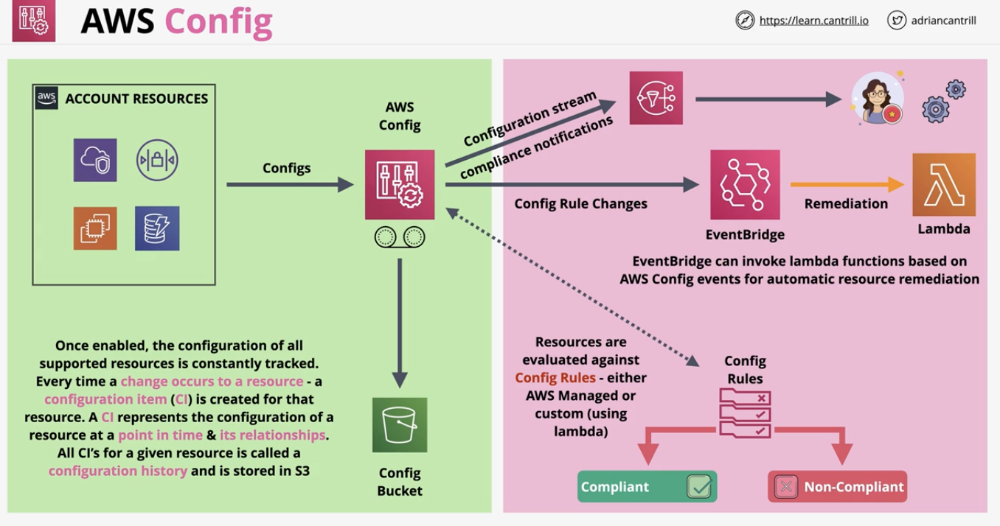
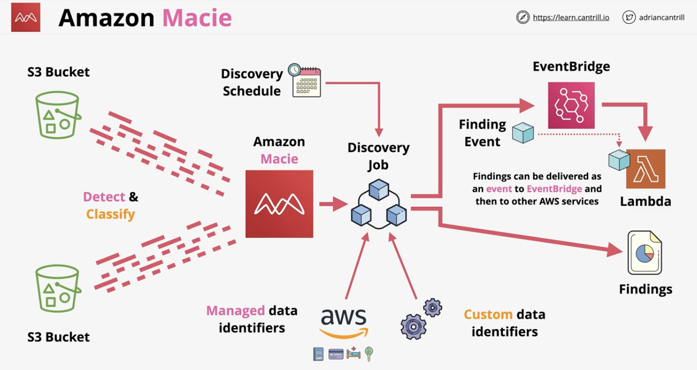

# Security, Deployment & Operations

### AWS Secrets Manager
- Overview
  - Designed for secrets
  - Supports automatic rotation via lambda
  - Directly integrates with some AWS products (e.g. RDS) 
- Architecture:
  - 
- Questions that contain: secrets, rotation, RDS == secrets manager 

### AWS WAF & Shield
- Shield Overview:
  - Provides AWS resources with DDoS protection 
  - Types of Shield:
    - Standard - 
      - free with Route 53 and CloudFront 
      - Protection against Layer 3 and Layer 4 DDos attacks
      - Use this be default 
    - Advanced
      - $3,000 per month
      - EC2, ELB, CloudFront, Global Accelerator, and R53
      - DDoS response team & financial insurance 
- Web Application Firewall (WAF) Overview:
  - Layer 7 (HTTP/s) firewall 
  - Protects against complex layer 7 attacks/exploits
    - e.g. sql injections, cross-site scripting, geo blocks, rate awareness
  - Web access control list (WEBACL) integrated with ALB, API gateway, and cloudfront 
  - Rules are added to WEBACL and evaluated when traffic arrives 
- Architecture using Shield and WAF:
  - DDoS == Shield
  - Layer 7 filtering, HTTP/HTTPS filtering == WAF
  - 

### CloudHSM
- Overview:
  - Similar to KMS, which is:
    - AWS Managed (managed hardware and software)
    - Keys are shared with other accounts, but seemingly separated from other accounts
  - Conversely, CloudHSM is:
    - `true "single tenant" hardware security model (HSM)`
    - AWS is provisioned, but the hardware is fully customer managed (AWS cannot get in)
    - `Fully FIPS-140-2 Level 3` (KMS is L2 overall, with some L3)
    - `Access with Standard APIs: PKCS#11, Java Cryptography Extensions (JCE), Microsoft CryptoNG (CNG) libraries`
    - KMS can use CloudHSM as a custom key store, CloudHSM integration with KMS 
- Architecture:
  - CloudHSMs exist is only 1 AZ (so need multiple for HA) 
    - The keys are kept in sync via HSM once they're set to be a cluster (do not need to be managed)
    - 
- Use cases:
  - No native AWS integration (e.g. no S3 SSE)
    - Can use on client side
  - Offload the SSL/TLS processing for web servers 
    - Helps to accelerate the cryptographic process compared to doing it on an EC2 instance 
  - Enable transparent data encryption (TDE) for Oracle databases 
  - Protect the private keys for an issuing certificate authority (CA) 
- Tl;DR: 
  - If have any application that has to integrate with products which aren't AWS, then use CloudHSM 
  - If need to integrate with AWS, then use KMS 
  - If need to have Level 3 security for FIPS 140-2, then use CloudHSM 
  - If need to utilize industry-standard encryption APIs, then use CloudHSM 

### AWS Config
- Overview:
  - Record configuration changes over time on resources 
    - Useful for auditing of changes and compliance with standards
  - Does not prevent changes from happening, thus no protection 
  - Regional service - supports cross-region and cross-account aggregation
  - Changes can generate SNS notifications and near-realtime events via EventBridge and Lambda 
- Standard vs Optional
  - 

### Amazon Macie 
- Overview:
  - Discover, monitor, and protect data stored in S3 buckets 
  - Automated discovery of data (e.g. important pieces of information like social security)
  - Types of Data Identifiers:
    - Managed:
      - Built in with ML/Patterns
      - Manage growing list of common sensitive data types (credentials, finance, health, personal identifiers)
      - Default, managed by AWS 
    - Custom 
      - Proprietary 
      - Regex pattern based created by you (e.g. employee IDs, etc.)
      - Can add keywords 
      - Maximum match distance - how close keywords are to regex pattern 
      - Ignore words - if regex match contains ignore words, then it's ignored
  - Types of Findings:
    - Policy finding
      - Policy or settings of an S3 bucket are changed which reduces the security of an S3 bucket
      - Only applicable after Macie is enabled
    - Sensitive data findings 
      - Discovers sensitive data in S3 buckets 
  - Look at data in S3 buckets to try to find matches
  - Integrates with security hub & 'finding events' to EventBridge 
  - Centrally managed either via AWS ORG or one Macie Account Inviting 
- Architecture:
  - 
