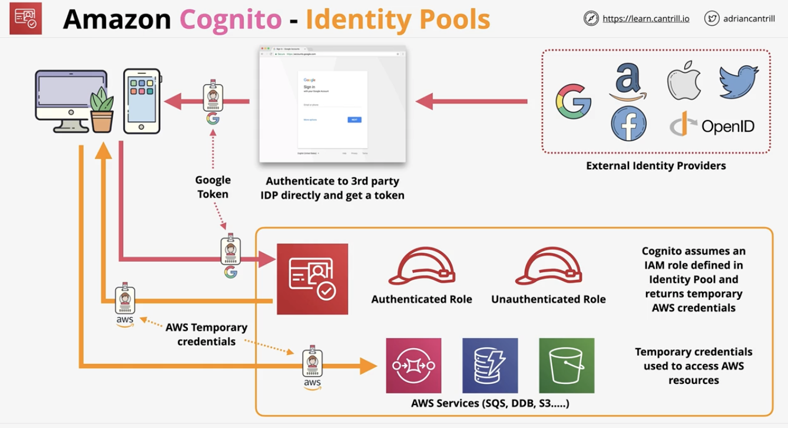

# Serverless and Application Services

### Architecture Deep Dive
- Overview:
  - Monolithic applications are bad because they:
    - fail together
    - scale together
    - bill together
- Evolving with Queues:
  - Allows for asynchronous communication between the different parts of the application 
  - Ex:
    - Uploads does its things then puts the job for processing into a queue
    - Then Processing is in an Auto Scaling Group which adds/removes instances to process the cat videos as they come in
      - The ASG scales based on the number of items in the queue 
- Event-Driven Architecture:
  - No constant running or waiting for things
  - Producers generate events when something happens 
    - e.g. clicks, errors, criteria met, uploads, actions
  - Events are delivered to consumers of this event
    - actions are taken & the system returns to waiting 
  - Mature event-driven architecture only consumes resources while handling events

### AWS Lambda
- Overview:
  - Function as a service - short running & focused 
  - Lambda function - piece of code lambda runs 
  - Functions use a runtime (e.g. python 3.8)
  - Functions are loaded and run in a runtime environment 
  - The environment has a direct memory (indirect CPU) allocation 
  - You're billed for the duration that a function runs
  - Key part of serverless architectures 
  - `900s (15 minute) function timeout`
  - Security controlled with Execution Role (IAM role) and attaching to a specific lambda function 
- Common uses:
  - Serverless applications (S3, API Gateway, Lambda)
  - File processing (S3, S3 events, Lambda) 
  - Database triggers (dynamoDB, streams, lambda) 
  - Serverless CRON (everbridge/CWEvents + lambda) 
  - Realtime stream data processing (kinesis + lambda) 
- Networking:
  - Public networking:
    - By default, lambda functions are given public networking
    - Can access AWS services and public internet 
    - Offers best performance because no customer specific VPC networking is required 
    - Con: Lambda functions have no access to VPC based services unless public IPs are provided and security controls allows external access
  - VPC networking:
    - Lambda functions in the VPC must obey all VPC networking rules 
    - Con: they can't access services outside the VPC unless the VPC is set up to do so 
      - To get around this, use a VPC endpoint to provide access to public AWS services, or
      - Use a NAT gateway connected to internet gateway to connect to public services 
        - Required for VPC lambdas to access internet resources 
- Security:
  - Execution role 
  - Resource policy (similar to bucket policy in S3)
    - Change accounts who can access the lambda functions
- Logging:
  - Lambda uses cloudwatch, cloudwatch logs & x-ray
  - Logs from lambda executions - cloudwatchlogs
  - Metrics - invocation success/failures, retries, latency - stored in cloudwatch 
  - Lambda can be integrated with x-ray for distributed tracing 
  - CloudWatch Logs requires permissions via Execution Role 
- Invocation:
  - Synchronous
    - CLI/API invokes a lambda function, passing in data and waits for a response 
    - Lambda function responds with data or fails
    - Result (success or failure) returned during the request 
    - Errors or retries have to be handled within the client side
  - Asynchronous 
    - Typically, used when AWS services invoke lambda functions on our behalf 
    - Lambda is responsible for retries if an event fails. It will try between 0 to 2 more times (config field) 
    - Lambda function needs to be idempotent reprocessing a result should have the same end state 
      - idempotent = can run the same function as many times as you want and the outcome will still need the same 
        - e.g. want to update bank balance to 20 when it's currently at 10:
          - set the balance to 20 (idempotent)
          - increase current balance by 10 (not idempotent) (would not have the same result in the case of a failure)
      - Lambda function needs to end in a desired state 
    - Events can be sent to dead letter queues after repeated failed processing 
    - Lambda supports destinations (SQS, SNS, Lambda & EventBridge) were successful or failed events can be sent
  - Event source mappings 
    - Typically, used on streams or queue which don't support event generation to invoke lambda (Kinesis, DynamoDB stream, SQS)
    - Event course mapping: 
      - Polls a service for new data, then gets back a Source Batch 
      - Source batches are broken up as required based on the batch size, then sent into Lambda as event batches 
      - Then lambda processes this batch 
        - Keep in mind the 15-minute timeout function limit 
      - Event batches are processed OK or FAIL as a batch (no partial work/fail)
      - TL;DR: Event Source Mappings read/poll from the stream or queue and delivery event batches to lambda
      - Permissions from the lambda execution role are used by the event source mapping to interact with the event source 
      - SQS queues or SNS topics can be used for any discarded failed event batches 
- Lambda versions:
  - Lambda functions have versions - v1, v2, v3
  - A version is the code + the configuration of the lambda function
  - It's immutable - it never changes once published & has its own Amazon Resource Name
  - $Latest points to the latest version 
  - Aliases (DEV, STAGE, PROD) point at a version - can be changed 
- Lambda startup times 
  - A lambda function can reuse an execution context but has to assume it can't. 
    - If used infrequently contexts will be removed
    - Concurrent executions will use multiple (potentially new) contexts
  - Provisioned concurrency can be used. AWS will create and keep X  contexts warm and ready to use, thus improving start speeds

### CloudWatchEvents and EventBridge
- Overview:
  - If X happens, or at Y time(s), then do Z
    - Y time is in UNIX CRON format
  - EventBridge is CloudWatch Events v2 (*)
  - A default Event bus for the account 
    - In CloudWatch Events, this is the only bus (implicit)
  - EventBridge can have additional event busses 
  - Rules match incoming events (or schedules) 
  - Route the events to 1+ Targets (e.g. Lambda)

### Serverless Architecture
- Applications are a collection of small and specialized functions
  - They are stateless and ephemeral environments - duration billying 
- Event-driven - consumption only when being used
- Examples:
  - API Gateway
  - Lambda
  - Step Functions
  - S3

### Simple Notification Service
- Public AWS service - network connectivity with public endpoint 
- Coordinate the sending of delivery of messages
- Messages are <= 256KB payloads
- SNS topics are the base entity of SNS - permissions and configs 
- a Publisher sends a messages to a TOPIC
- TOPICS have subscribers which receive messages 
- 
- Delivery Status (including HTTP, Lambda, SQS)
- Delivery retries - reliable delivery 
- HA snd Scalable (region) 
- server side encryption (SSE) 
- Cross-account via TOPIC policy (same as resource policy with S3)

### Step Functions
- Basically a state machine 
  - Long-running serverless workflow 
- Standard Workflow 
  - is the default and has a one year execution limit
- Express Workflow
  - is designed for high volume event processing workloads (e.g. IOT)
  - Use for highly transactional things 
  - Can run up to 5 minutes 
- Started via API gateway, iot rules, eventbridge, lambda 
- IAM role used for permissions
- States:
  - SUCCEED & FAIL
  - WAIT
  - CHOICE 
  - PARALLEL 
  - MAP
  - TASK (represents a single unit of work. Allows the state machine to do work)

### API Gateway
- Overview:
  - Create and manage APIs
  - Endpoint/entry-point for applications
  - Sits between applications & integrations (services)
  - Highly available, scalable, handles auth, throttling, caching, CORS, transformation, openAPI spec, direct integration into AWS services, and much more
  - Public services; can connect to services/endpoints in AWS or on-premises 
  - HTTP APIs, REST APIs and websocket APIs
- Architecture:
  - 
- Authentication:
- 4xx errors - client errors
- 5xx errors - server errors. backend issues but valid request
- 400 - bad request generic
- 403 - access denie. authorizer denies
- 429 - api gateway can throttle - means exceeded amount of throttle
- 502 - bad gateway exception - bad output
- 503 - service unavabile 
- 504 - integration failure/timeout of 29s limit 

### Simple Queue Service
- Overview:
  - Public, fully managed, highly available
  - Types:
    - FIFO, or
    - Standard (best effort, can come out of order)
  - Messages up to 256KB in size - link to large data 
  - Received messages are hidden (VisibilityTimeout)
    - VisbilityTimeout = amount of time that a message is hidden when it's received 
      - AKA how long something has to process and delete a queue message before it reappears
    - If the message is not explicitly deleted, then it'll reappear back in the queue to be processed again
  - Dead letter queues can be used for problem messages 
    - If a message is received 5+ times and hasn't been deleted, then can move to dead-letter queue 
    - ASG can scale and Lambas invoked based on queue length 
- Architecture example:
  - 
- Types of queues:
  - Standard:
    - at-least-once
    - Can have more than 1 delivery
  - FIFO: 
    - Exactly-one 
    - 3,000 messages per second with batching, or up to 300 messages per second without 
    - Less performance than Standard
  - Billed based on 'requests'
  - 1 request = 1 to 10 messages up to 256KB total 
  - Short (immediate) vs Long (waitTimeSeconds) polling 
    - Short
    - Long - better because can have multiple messages per queue
      - Up to 20 seconds for a wait 
      - Best option to pull SQS 
  - Encryption at rest using KMS and in-transit 
  - Access to queue is based on identity policy or queue policy (also similar to resource policy; access from external accounts)

### Kinesis Data Streams
- Overview:
  - Real-time access to data 
  - Scalable streaming service 
  - Producers send data into kinesis stream 
  - Streams can scale from low to near infinite date rates
  - Public service and highly available by design 
  - Streams store 24-hour moving window of data 
  - Multiple consumers access data from that moving data 
  - Good for analytics and dashboards 
- Architecture:
  - A kinesis stream contains 1 - N shard
  
- SQS vs Kinesis 
  - Ingestion of data or ingestion of data at scale (large throughput or large number of devices), it's likely Kinesis
  - SQS:
    - SQS 1 production group, 1 consumption group
    - SQS decouples and asynchronous communications
    - No persistence of messages on a queue. No window 
  - Kinesis:
    - Designed for huge scale ingestion 
    - Designed for multiple consumers on a rolling window 
    - Designed for data ingestion, analytics, monitoring, app clicks

### Kinesis Data Firehose
- Overview: 
  - Fully managed service to load data for data lakes, data stores, and analytics services
  - Automatic scaling, fully serverless, resilient
  - `Near real time delivery (~60 seconds)` 
  - Supports transformation of data on the fly (lambda) 
  - Billing - volume through firehose 
- Architecture:
  - Valid destination:
    - HTTP 
    - Splunk
    - Redshift
      - Note: Doesn't store directly into redshift
      - Copy to intermediate S3 bucket, then copy that into redshift 
    - ElasticSearch
    - Destination Bucket 
  - Data is buffered in size MB (1) fills or buffer intervals in seconds (60) passes

### Kinesis Data Analytics
- Overview:
  - Real time data processing of data using SQL 
  - Ingests from Kinesis Data Streams or Firehose 
  - Send data to destinations:
    - Firehose (S3, Redshift, ElasticSearch & Splunk)
    - AWS Lambda
    - Kinesis Data Streams
- Architecture:
  - 
- When and where to choose Kinesis Data Analytics
  - Streaming data that needs `real-time` SQL processing
  - Time-series analytics (elections, esports)
  - Real-time dashboards - leaderboards for games 
  - Real-time metrics - Security & response team

### Amazon Cognito - User and Identity Pools
- Overview:
  - Service that provides Authentication, Authorization, and user management for web/mobile apps 
  - USER POOLS - sign-in and get a JSON web token (JWT)
    - Most AWS services cannot use JWT
    - User directory management and profiles, sign-up and sign-in (customisable web UI), MFA, and other security features 
  - Identity pool - allows you to offer access to Temporary AWS credentials 
    - Unauthenticated identities - guest users 
    - Federated identities - SWAP - Google, FB, Twitter, SAML2.0 & user pool for short term AWS credentials to access AWS resoruces
  - Difference:
    - User pools: 
      - offering sign-up or sign-in experience with user directory and profile management services 
      - About login and about managing user identities 
    - Identity pools:
      - Swapping either an unauthenticated or authenticated identity for AWS credentials
      - One possible identity may be a user pool identity 
      - Work by assuming an IAM role on behalf of identity 
- Architecture with only User Pools
  - API Gateway can accept JWTs for authentication
  - 
  - Downside: can't access AWS services
- Architecture with only Identity Pools:
  - 
  - Downside: need to set up config for each type of user (Google, FB, Twitter, etc.) 
- Architecture with both user and identity pools:
  - 